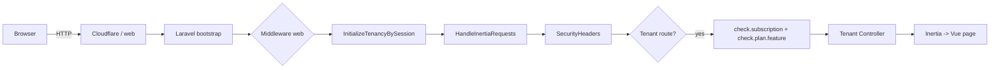

# ServiceKU — Architecture

> Dokumen ini adalah referensi resmi arsitektur **ServiceKU** (SaaS multi-tenant untuk pusat servis elektronik & handphone). Ditulis berdasarkan kondisi source code saat ini. Jangan membuat asumsi yang bertentangan dengan kode.

---

## 1. Ringkasan

**ServiceKU** adalah platform SaaS manajemen pusat servis dengan model **multi-tenant** (satu database pusat + satu database per tenant). Setiap tenant adalah toko/company (mis. "Toko ABC") yang memiliki data sendiri: servis, pelanggan, produk, penjualan, keuangan, cabang, dll.

| Aspek | Nilai |
|---|---|
| Framework | Laravel (`laravel/framework ^12.0`, PHP `^8.2`) |
| Frontend | Vue 3 (Composition API, `<script setup>`) + Inertia.js v3 |
| Styling | TailwindCSS 3.4 + CSS Variables (design tokens) |
| Build | Vite 6 (`vite.config.js`) |
| Routing (frontend) | Ziggy (`ziggy-js ^2.6`) |
| Multi-tenancy | `stancl/tenancy ^3.10` |
| Database dev | SQLite (central + per-tenant `.sqlite`) |
| Database prod | MySQL (central + per-tenant schema/DB) |
| Payment | Midtrans (`midtrans/midtrans-php`) |
| 2FA | `pragmarx/google2fa-laravel` |
| PDF | `barryvdh/laravel-dompdf` |
| Email | Laravel Mail (Brevo SMTP via `MailConfigService`) |
| Error tracking | Sentry (`sentry/sentry-laravel`) |

> **Catatan versi:** `composer.json` meng-haruskan `laravel/framework ^12.0` (bootstrap style `Application::configure`). README menyebut "Laravel 11" — dokumentasi produk lama, yang benar adalah Laravel 12.

---

## 2. Model Multi-Tenancy

ServiceKU memakai **stancl/tenancy v3** dengan skema **"satu database per tenant"**:

- **Central DB** — data platform: `tenants`, `domains`, `plans`, `payment_transactions`, `vouchers`, `system_settings`, `system_logs`, `tenant_stats`, `tenant_otps`, `registration_verifications`, `users` (admin), `jobs`, `cache`, dll.
- **Tenant DB** — data bisnis per toko: `users`, `services`, `customers`, `products`, `sales`, `expenses`, `branches`, `inventory_mutations`, `daily_deposits`, `cash_registers`, `tenant_settings`, `activity_logs`, `checklist_templates`, dll.

### Identifikasi tenant
Hybrid dua jalur (lihat `routes/tenant.php` + middleware `InitializeTenancyBySession`):

1. **Domain/subdomain** — tenant diakses via subdomain seperti `kirom.serviceku.my.id`. Pada halaman `/`, kode mengecek `Domain` dan meng-initialize tenancy + menyimpan `tenant_id` di session.
2. **Session** — setelah login, `LoginController` meng-initialize tenancy secara manual lalu menyimpan `tenant_id` di session; middleware `InitializeTenancyBySession` memakai session tersebut pada request berikutnya.

### Konfigurasi tenancy (`config/tenancy.php`)
- `tenant_model` → `App\Models\Tenant` (UUID generator).
- `central_domains` → `serviceku.my.id`, `www.serviceku.my.id`, `admin.serviceku.my.id` (dari env).
- Bootstrappers aktif: **Database**, **Filesystem**, **Queue**. (Cache/Redis tenancy nonaktif.)
- `database.prefix` → `tenant_` (nama DB tenant = `tenant_<uuid>`).
- Migrasi tenant dipisah di `database/migrations/tenant` (30 file); central di `database/migrations` (19 file).
- Provisioning tenant berjalan **sinkron** (`shouldBeQueued(false)`) — DB tenant dibuat + dimigrasi saat `TenantCreated`.

### Pemisahan kode Central vs Tenant
- **Central** (model + controller "platform"): `App\Models\{Tenant,Plan,Payment,Voucher,SystemSetting,...}` dan `App\Http\Controllers\Admin\*`.
- **Tenant** (business domain): `App\Models\Tenant\*` (46 model) dan `App\Http\Controllers\Tenant\*` (54 controller).

---

## 3. Alur Request (Request Lifecycle)

1. Request masuk, `bootstrap/app.php` mendaftarkan middleware web: `HandleInertiaRequests`, `SecurityHeaders`, dst.
2. Jika ada `session('tenant_id')`, `InitializeTenancyBySession` meng-initialize tenancy.
3. `HandleInertiaRequests` menyuntikkan shared props ke seluruh halaman Inertia (auth user, tenant theme, plan access, role permissions, flash, dll).
4. Route tenant dilindungi middleware `tenancy.session` + `auth` + `check.subscription`; akses fitur dijaga per-route `check.plan.feature:<feature>`.
5. Controller mengembalikan `inertia('PageName', props)` → Vue merender halaman.
6. Error render ke halaman Inertia `Pages/Errors/{403,404,419,500,503}` (non-local).

---

## 4. Boundary Utama (Subsistem)

### 4.1 Central (Platform)
- **Auth & Registrasi tenant** — `RegisteredTenantController` (registrasi 3 langkah + OTP email), `AdminAuthController` (login superadmin).
- **Admin / Superadmin** — `Admin\SuperAdminController`, `TenantManagementController` (CRUD tenant, suspend/activate, extend trial, login-as, reset password), `PlanController`, `VoucherController`, `PaymentController` (invoice + webhook), `SystemSettingsController`, `BackupController`, `MonitoringController`.
- **Subscription/Billing** — `Plan` (fitur + harga + promo), `Tenant.subscription_status` (trial/active/expired/suspended), `Payment` (Midtrans), middleware `CheckSubscription`, command `subscription:check`.
- **Landing page** — `routes/web.php` route `/` merender `welcome` + daftar plan.

### 4.2 Tenant (Business)
- **Servis (core workflow)** — `Tenant\ServiceController` + `ServiceWorkflowController` (state machine status servis), `ServiceChecklistController`, `ServiceDocumentController` (receipt PDF), `ServiceClaimController` (garansi), `ServicePhotoController` (Google Drive).
- **Penjualan/POS** — `SaleController`, `SaleStoreController`, `SalePaymentController`, `SaleInvoiceController`.
- **Inventori** — `ProductController`, `PurchaseController`, `PurchaseReturnController`, `InventoryController` (mutasi, reorder, forecast), `StockAllocationController`, `DamagedStockController`.
- **Keuangan** — `ExpenseController`, `DailyDepositController`, `FinanceController`, `CashController`, `ReconciliationController`, `CommissionController`, `TaxController`, `CashRegisterController`.
- **HR/Operasional** — `UserManagementController` (roles), `ShiftController`, `AttendanceController`, `PartnerTeknisiController`, `PickupDeliveryController`.
- **Penunjang** — `CustomerController`, `MasterDataController`, `KnowledgeBaseController`, `QuickReplyController`, `SopController`, `CustomFieldController`, `SearchController`, `MonitoringController`, `ReportController` (9 jenis laporan), `TenantProfileController`, `BillingController`.
- **Fitur terbatas plan** — `CheckPlanFeature` per-route; `read_only` membatasi hanya GET.

---

## 5. Autentikasi & Keamanan

- **Login tenant** — `Auth\LoginController` (rate limit `throttle:login` 6/min); resolusi tenant via session → domain → email.
- **2FA** — `Auth\TwoFactorController` + `TwoFactorSetupController` (google2fa TOTP + recovery codes + fallback kode email), gate `FeatureFlagService::isEnabled('two_factor_auth')`.
- **Email verification** — `Tenant\User implements MustVerifyEmail`; `Auth\EmailVerificationController` (signed URL); route `/email/verify/*`.
- **Google login** — `Auth\GoogleLoginController` (Socialite) di landing + tenant; kolom `google_id`/`google_avatar`.
- **Password reset** — `Auth\ResetPasswordController`.
- **Superadmin** — middleware `admin.auth` (`AdminAuthenticate`).
- **Keamanan HTTP** — `SecurityHeaders` (CSP, X-Frame-Options DENY, nosniff, HSTS), `trustProxies(at: '*')` (di `bootstrap/app.php`), CSRF exception hanya untuk `payment/webhook` & `customers/ajax-store`.
- **Rate limiter** — `login` (6/min), `register` (3/min), `otp` (2/min), `api` (60/min).

---

## 6. Subscription & Billing

- **Plan** (`App\Models\Plan`): `name`, `slug`, `price`, `promo_price` (+ window promo), `trial_days`, `features` (JSON nested per business type), `business_types`.
- **Tenant subscription state** — `subscription_status` (trial/active/expired/suspended), `trial_ends_at`, `subscribed_at`, `subscription_ends_at`, `is_active`.
- **Middleware `CheckSubscription`** — auto-expire trial/subscription lewat tanggal, blokir akses kecuali halaman `settings.*`.
- **Activasi otomatis** — model `Payment` event `updated` → jika sukses, perpanjang `subscription_ends_at` tenant (+ `extra_months` dari voucher).
- **Voucher** — `Voucher` (kode promo, diskon/extra months, per-tenant), di-apply di `BillingController` / `VoucherApplyController`.
- **Command `subscription:check`** (tiap jam) — auto-expire via scheduler.

---

## 7. Scheduler (Scheduled Tasks)

Definisi di `bootstrap/app.php` (`withSchedule`):

| Waktu | Perintah | Fungsi |
|---|---|---|
| 03:00 | `backup:run --force` | Backup DB + storage (jika `backup_auto_enabled`) |
| 04:00 | Google Drive upload | Upload folder backup (jika `gdrive_enabled`) |
| Setiap jam | `subscription:check` | Auto-expire subscription/trial |
| 02:00 | `tenants:cleanup --days=30 --force` | Hapus tenant expired > 30 hari + DB-nya |
| Setiap jam | `queue:retry --all` | Retry job gagal |
| Harian | `cache:clear`, `session:gc` | Perawatan |

Command custom: `BackupRun`, `CheckSubscriptionExpiry`, `TenantCleanup`.

---

## 8. Error Handling & Observability

- `bootstrap/app.php` `withExceptions`:
  - Non-local → kirim exception ke Sentry.
  - `/api/*` atau `expectsJson` tanpa auth → JSON 401.
  - Error 403/404/419/500/503 (non-local) → render halaman Inertia `Pages/Errors/<code>`.
- `config/sentry.php` ada; `SystemLog` model untuk audit log internal.

---

## 9. Keputusan Arsitektur yang Wajib Dihormati

1. **Satu DB per tenant** — jangan menaruh data bisnis tenant di central DB; jangan cross-query antar tenant.
2. **Controller ber-role** — pindahkan controller sesuai namespace `Tenant/`, `Admin/`, `Auth/`, `Api/`.
3. **Perlindungan fitur** — setiap resource tenant di-route harus dilindungi `check.plan.feature:<feature>`.
4. **Frontend wajib pakai komponen `K*`** — dilarang HTML mentah (`<button>/<input>/<select>/<textarea>`) di halaman (lihat `docs/Component.md`).
5. **Satu-satunya jalur data ke frontend adalah Inertia props** — tidak ada API REST internal untuk UI (selain endpoint publik `api/` dan search).
6. **Tenant DB menggunakan connection dinamis** dari stancl — jangan hardcode nama DB.
7. **Timezone** — aplikasi memakai timezone dari config `app.timezone` (default `UTC`); UI menampilkan waktu sesuai `page.props.timezone`.
