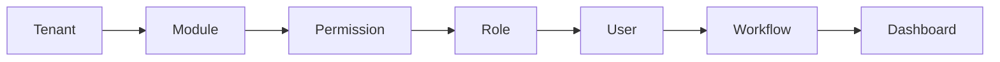

# Architecture Decision — ServiceKU

> **Dokumen keputusan arsitektur (target).** Semua keputusan di sini adalah **keputusan target/roadmap** — TIDAK diimplementasikan pada dokumen ini.
> Setiap bagian mencantumkan **Kondisi Saat Ini (source)** vs **Target (keputusan)** agar tidak membingungkan dengan `docs/` (Sprint 4).
> Dokumen tertinggi: `docs/specification/PROJECT_SPECIFICATION.md`.

---

## 1. Keputusan Utama: **ERP Modular Architecture** (bukan Business Type Driven)

| Aspek | Kondisi Saat Ini (source) | Target (Keputusan) |
|---|---|---|
| Fondasi | Business type menentukan fitur domain runtime (`getBusinessTypeFeatures`) + plan | **ERP Modular**: platform = kumpulan modul independen; tenant menyalakan modul sesuai kebutuhan |
| Business Type | Memengaruhi fitur aktif saat runtime | Hanya **template onboarding** — menentukan set modul/role default saat setup |
| Modul | Feature keys tersebar (`CheckPlanFeature`) | **Module Registry** terpusat; setiap modul = fitur + permission + routes + halaman + menu |
| Peran business type | Menentukan akses fitur | Tidak lagi memutuskan akses runtime; hanya menyiapkan konfigurasi awal |

**Alasan:** pertumbuhan bisnis (retail → terima servis → service center) seharusnya tidak butuh migrasi data atau perubahan arsitektur — cukup mengaktifkan modul.

---

## 2. Rantai Inti (Core System Chain)

Sistem dibangun dari rantai berikut (urutan inisialisasi & resolusi):

| Langkah | Komponen | Peran |
|---|---|---|
| 1 | **Tenant** | Entitas multi-tenant (1 DB per tenant); berisi konfigurasi (plan, business template, cabang) |
| 2 | **Module** | Unit fungsional terdaftar (Service, POS, Inventory, …) dengan fitur & permission-nya |
| 3 | **Permission** | Aturan akses atomik (mis. `service.create`, `pos.void`) — pusat sistem |
| 4 | **Role** | Kumpulan permission (template); tidak hardcoded (target) |
| 5 | **User** | Dapat memiliki **satu atau lebih role** (target); permission = union |
| 6 | **Workflow** | State machine yang mengikuti **modul**, bukan business template |
| 7 | **Dashboard** | Dibangun dari **permission** (bukan nama role) |

Detail tiap komponen: `ModuleEngine.md` s.d. `DashboardEngine.md`.

---

## 3. Prinsip Keputusan

1. **Permission-centric** — segala akses diselesaikan lewat permission, bukan pengecekan nama role.
2. **Modular** — fitur baru = modul baru (registry), tanpa mengubah inti.
3. **Configurable, not hardcoded** — role, workflow, dashboard, fitur dikonfigurasi data, bukan string di kode.
4. **Backward compatible** — target tidak boleh merusak kondisi saat ini; migrasi bertahap.
5. **Tenant isolation preserved** — 1 DB per tenant tetap; tidak ada cross-query.

---

## 4. Perubahan yang Diperlukan (Roadmap) — Ringkas

| # | Perubahan | Dari → Ke | Dokumen |
|---|---|---|---|
| 1 | Module registry | Feature keys tersebar → registry terpusat | ModuleEngine.md |
| 2 | Permission engine | `role_permissions` hardcoded → tabel permission | PermissionEngine.md |
| 3 | Role engine | Role string hardcoded → role dinamis (CRUD owner) | RoleEngine.md |
| 4 | User engine | 1 kolom `role` → many-to-many roles | UserEngine.md |
| 5 | Business template | Business type = runtime gate → onboarding template | BusinessTemplateEngine.md |
| 6 | Workflow engine | Status per modul tersebar → workflow terdefinisi per modul | WorkflowEngine.md |
| 7 | Dashboard engine | Berdasarkan role name → berdasarkan permission | DashboardEngine.md |
| 8 | Subscription engine | Plan = fitur tetap → engine kontrol (module/limit/feature/storage/user/branch/API/backup/WA/marketplace/AI) | SubscriptionEngine.md |
| 9 | Feature engine | Toggle di kode → toggle data tanpa deploy | FeatureEngine.md |

---

## 5. Batas & Non-Goals (Target)

- **TIDAK** mengubah skema multi-tenancy (1 DB per tenant).
- **TIDAK** menghapus `role_permissions`/business type saat ini dalam satu langkah — migrasi bertahap.
- **TIDAK** menambah business type/role baru (lihat spesifikasi).
- **TIDAK** mengimplementasikan modul Future sebelum terdaftar di ModuleEngine.

---

## 6. Verifikasi

Semua bagian "Kondisi Saat Ini" diambil dari source (Sprint 4 docs + `HandleInertiaRequests` + `Tenant.php` + `PlanSeeder`). Bagian "Target" adalah keputusan arsitektur yang belum diimplementasikan dan ditandai eksplisit sebagai **target/roadmap**.
