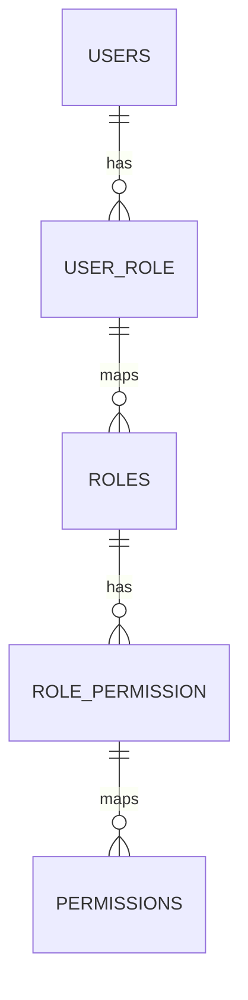

# Role Engine — ServiceKU

> **Keputusan target:** role **tidak hardcoded** sebagai string. Role = entitas data berisi kumpulan permission; **owner** dapat membuat/mengedit/menggabung role; user dapat memiliki **multi-role**.
>
> ⚠️ Ini adalah **target/roadmap**. Kondisi saat ini: role adalah string (`role` column) dan `role_permissions` hardcoded.

---

## 1. Kondisi Saat Ini (source) vs Target

| Aspek | Saat Ini (source) | Target |
|---|---|---|
| Definisi role | String hardcoded (`owner`, `admin`, `manager`, `head_store`, `cs`, `technician`, `cashier`, `courier`, `custom`) | Entitas `roles` di DB (tenant) |
| Permission role | Array `role_permissions` hardcoded | Pivot `role_permission` |
| Role per user | **1 kolom `role`** (single) | **Many-to-many** (`user_role`) — user bisa multi-role |
| Pembuatan role | Tidak ada (kode) | Owner dapat buat/edit/merge role |
| Role bawaan | 9 (7 resmi + head_store/courier/custom) | Seeded default (tetap 7 resmi; sisanya bisa dinonaktifkan) |

---

## 2. Model Data (Target)

- `roles`: id, tenant_id, name, key (unique per tenant), is_system (default), permissions (via pivot).
- `user_role`: user_id ↔ role_id (banyak-banyak).
- Role bawaan (`owner`, `admin`, `manager`, `cs`, `technician`, `cashier`) = **system roles** (tidak dapat dihapus, permission dapat disesuaikan oleh owner).

---

## 3. Operasi Role (Target)

| Operasi | Siapa | Catatan |
|---|---|---|
| Buat role kustom | Owner | Copy dari role lain atau kosong |
| Edit permission role | Owner | Menambah/mengurangi permission |
| Hapus role | Owner | Tidak bisa hapus system role |
| Merge role | Owner | Gabungkan 2 role → user dipindahkan |
| Assign multi-role ke user | Owner | Union permission |

---

## 4. Aturan Role Engine

1. **7 role resmi** tetap menjadi default (Super Admin terpisah — platform). Jangan menambah role "resmi" baru (lihat PROJECT_SPECIFICATION §6).
2. Role **kustom** boleh dibuat owner — bukan bagian dari "role resmi" (tidak mengubah dokumen spesifikasi).
3. Pengecekan aksi selalu via **permission** (Permission Engine), bukan nama role.
4. `head_store`, `courier`, `custom` saat ini ada di source — di target dapat dimigrasikan sebagai role data (seeded) yang bisa dinonaktifkan tenant bila tidak dipakai.

---

## 5. Verifikasi

Kondisi saat ini (single `role` column + `role_permissions` hardcoded) terkonfirmasi dari source. Konsep roles table, multi-role, merge, dan role kustom adalah **target/roadmap**.
