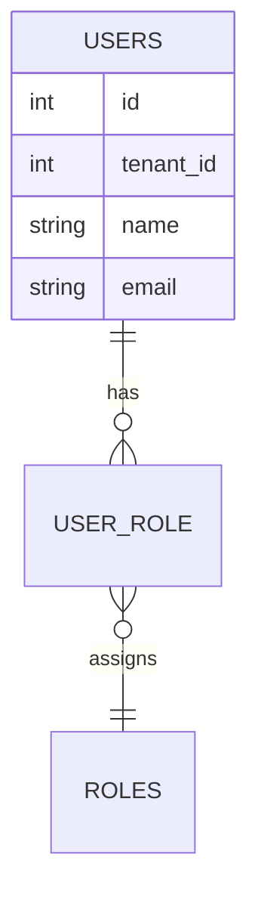

# User Engine — ServiceKU

> **Keputusan target:** user dapat memiliki **lebih dari satu role** (multi-role). Permission efektif = **union** dari seluruh role user.
>
> ⚠️ **Target/roadmap.** Kondisi saat ini: user punya **satu** kolom `role` (single role).

---

## 1. Kondisi Saat Ini (source) vs Target

| Aspek | Saat Ini (source) | Target |
|---|---|---|
| Role user | 1 kolom `role` (string) | Tabel pivot `user_role` (many-to-many) |
| Kombinasi peran | Tidak bisa (1 role) | Bisa: mis. `cashier` + `technician` |
| Permission | Dari 1 role | Union semua role |
| Manajemen | Owner mengubah kolom role | Owner mengatur daftar role per user |

---

## 2. Model Data (Target)



- Seorang user = 1 entitas; role dilampirkan lewat `user_role`.
- **Fleksibilitas:** teknisi yang juga kasir, CS yang juga menerima pembayaran, dll.

---

## 3. Resolusi Permission (Target)

```
permission(user) = UNION( permission(role) for role in user.roles )
```

- UI & server menghitung `can` dari union tersebut.
- Menu menampilkan gabungan menu dari semua role.
- Dashboard menampilkan akses gabungan (Dashboard Engine).

---

## 4. Aturan User Engine

1. Wajib memiliki **minimal 1 role**; boleh lebih.
2. Owner (atau admin ber-permission `user.manage`) mengelola role user.
3. Perubahan role langsung memengaruhi permission tanpa logout (di-recompute per request / Inertia props).
4. Multi-role tidak mengubah "role resmi" — tetap 7 + role kustom (Role Engine).
5. User Super Admin berada di **central** (platform), bukan tenant — terpisah dari user tenant.

---

## 5. Verifikasi

Kondisi saat ini (1 kolom `role`) terkonfirmasi dari source. Multi-role & union permission adalah **target/roadmap**.
