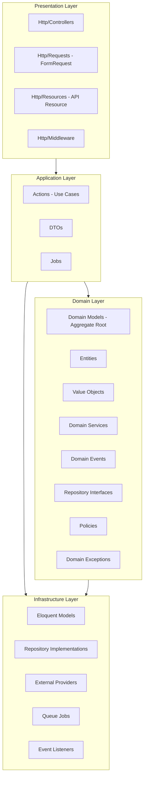

# 01 — Laravel Backend Architecture

> **Sprint 6.3 · Engineering Blueprint Only.** Arsitektur backend Laravel ServiceKU — menerjemahkan Blueprint v1.0 (FROZEN) menjadi struktur aplikasi.
> **Status: Engineering Blueprint.** Tidak ada kode, migration, atau implementasi.

---

## 1. Prinsip Arsitektur

| Prinsip | Implementasi |
|---|---|
| **SOLID** | Single Responsibility (Action pattern), Open/Closed (Provider pattern), Liskov (Repository interface), Interface Segregation (domain interfaces), Dependency Inversion (bind interface→implementation) |
| **DDD** | Domain layer dengan Aggregate Root, Entity, Value Object, Domain Service, Domain Event, Repository interface |
| **Clean Architecture** | Dependency rule: Domain → Application → Infrastructure → Presentation. Domain tidak tahu apa pun tentang framework. |
| **Event Driven** | Domain events + listeners; queue untuk async |
| **Service Layer** | Tipis di Controller; logika bisnis di Action + Domain Service |
| **Repository Pattern** | Interface di Domain; Eloquent implementation di Infrastructure |
| **Provider Pattern** | Sprint 6.2B — semua integrasi eksternal via interface+implementation |

---

## 2. Arsitektur 4-Layer



**Dependency Rule:** Dependencies point INWARD. Domain tidak tergantung apa pun. Application hanya tergantung Domain. Infrastructure mengimplementasi kontrak Domain. Presentation tergantung Application.

---

## 3. Request Flow (End-to-End)

```
HTTP Request
  → Middleware (tenant resolve, auth, plan feature check)
    → FormRequest (validation, authorization)
      → Controller (thin — orchestration only)
        → Action (single use case)
          → Repository (interface — data access)
          → Domain Service (business logic)
          → Domain Events (dispatch)
            → Listeners (audit, notification, history, dashboard)
          → Response (Resource / Redirect)
```

---

## 4. Laravel Versions & Packages

| Komponen | Versi / Package | Catatan |
|---|---|---|
| **Framework** | Laravel ^12.0 | Existing |
| **PHP** | ^8.2 | Existing |
| **Multi-Tenant** | stancl/tenancy ^3.x | Existing — 1 DB per tenant |
| **Auth (SPA)** | Sanctum | Existing |
| **Auth (Social)** | Socialite | Existing |
| **2FA** | google2fa | Existing |
| **Payment** | Midtrans (existing) + Provider Pattern | Sprint 6.2B |
| **PDF** | dompdf | Existing |
| **Error Tracking** | Sentry | Existing |
| **WebSocket** | Reverb | Existing (Companion Mode) |
| **Queue** | Redis / Database | Existing |

---

## 5. Namespace Architecture

| Namespace | Layer | Isi |
|---|---|---|
| `App\Domain\*` | Domain | Model, VO, Domain Service, Event, Repository Interface, Exception |
| `App\Domain\Shared\*` | Domain Shared | Base classes, shared VO (Money, PhoneNumber), shared interfaces |
| `App\Application\*` | Application | Actions (use cases), DTOs, Jobs |
| `App\Infrastructure\*` | Infrastructure | Eloquent models, Repository implementations, External Providers |
| `App\Http\*` | Presentation | Controllers, FormRequests, Resources, Middleware |
| `App\Support\*` | Support | Helpers, base classes, traits |

---

## 6. Modul Domain (dari Sprint 6.1)

| Module | Namespace | Domain utama |
|---|---|---|
| **Tenant** | `App\Domain\Tenant\` | Tenant aggregate (platform), Subscription |
| **Customer** | `App\Domain\Customer\` | Customer, Device |
| **Request** | `App\Domain\Request\` | Request (ADR-001), RequestHistory |
| **Service** | `App\Domain\Service\` | ServiceOrder, WorkOrder, Checklist, TechnicianAssignment |
| **Sales** | `App\Domain\Sales\` | SalesOrder, SaleItem |
| **Purchase** | `App\Domain\Purchase\` | PurchaseOrder, PurchaseItem |
| **Inventory** | `App\Domain\Inventory\` | InventoryItem, InventoryMovement |
| **Cash** | `App\Domain\Cash\` | CashShift, Deposit, Expense |
| **Supplier** | `App\Domain\Supplier\` | Supplier, ServicePartner |
| **Warranty** | `App\Domain\Warranty\` | Warranty, WarrantyClaim, SuplierClaim, Replacement |
| **Finance** | `App\Domain\Finance\` | FinanceTransaction, Compensation |
| **Policy** | `App\Domain\Policy\` | Policy |
| **User** | `App\Domain\User\` | User, Role, Permission, Position |
| **Notification** | `App\Domain\Notification\` | Notification |
| **Dashboard** | `App\Domain\Dashboard\` | DashboardWidget, ReportSnapshot |
| **Attachment** | `App\Domain\Attachment\` | Attachment |
| **Audit** | `App\Domain\Audit\` | AuditLog, HistoryLog |

---

## 7. Verifikasi

Arsitektur mengikuti Blueprint v1.0 (FROZEN). Domain → Table Blueprint tidak berubah. Provider Pattern diimplementasikan di Infrastructure. ADR-001 (Request = Core Entry Point) menjadi fondasi alur.
