# 01 — Enterprise Data Architecture

> **Sprint 6.2A · Blueprint Only.** Arsitektur data ServiceKU — acuan seluruh ERD, database, model, repository, API, query, reporting, search, audit, history, dan backup.
> **Status: Blueprint.** Bukan implementasi. Tidak ada SQL, migration, atau source code.

---

## 1. Arsitektur Data — 5 Layer

```mermaid
flowchart TD
    subgraph L1[Layer 1: Platform Data - CENTRAL]
        TENANT[Tenant]
        PLAN[Plan/Feature]
        VOUCHER[Voucher]
        PLATFORM_PAYMENT[Platform Payment]
        SUPERADMIN[Super Admin]
    end

    subgraph L2[Layer 2: Tenant Configuration]
        BRANCH[Branch]
        USER[User/Role/Permission]
        POLICY[Policy]
        SETTINGS[Settings]
        MODULE[Module/Feature active]
    end

    subgraph L3[Layer 3: Operational Master]
        CUSTOMER[Customer]
        DEVICE[Device/Asset]
        SUPPLIER[Supplier]
        PARTNER[Service Partner]
        PRODUCT[Product/Sparepart]
    end

    subgraph L4[Layer 4: Transactional - ENTRY via REQUEST]
        REQUEST[Request]
        SERVICE[Service Order]
        SALES[Sales Order]
        PURCHASE[Purchase Order]
        WARRANTY[Warranty/Claim]
        CASH[Cash Shift/Deposit]
        INVENTORY[Inventory Movement]
    end

    subgraph L5[Layer 5: Aggregate & Archive]
        FINANCE[Finance Aggregate]
        REPORT[Report]
        DASHBOARD[Dashboard Widget]
        ARCHIVE[Archive]
        AUDIT_LOG[Audit Log]
        HISTORY[History Log]
    end

    L1 --> L2
    L2 --> L3
    L3 --> L4
    L4 --> L5
```



| Layer | Isi | Scope | DB |
|---|---|---|---|
| **L1 Platform** | Tenant, Plan, Voucher, Super Admin, Platform Payment | Global / Platform | Central DB |
| **L2 Konfigurasi** | Branch, User, Role, Permission, Policy, Settings, Module | Per Tenant | Tenant DB |
| **L3 Master** | Customer, Device, Supplier, Partner, Product | Per Tenant | Tenant DB |
| **L4 Transaksional** | Request → ServiceOrder / SalesOrder / Purchase / Warranty / Cash / Inventory | Per Tenant | Tenant DB |
| **L5 Agregat & Arsip** | Finance rollup, Report, Dashboard, Archive, Audit, History | Per Tenant | Tenant DB |

---

## 2. Prinsip Arsitektur Data

| Prinsip | Implementasi Data |
|---|---|
| **Configuration over Code** | Policy, Module, Permission = data (bukan hardcode). |
| **Simple by Default** | Walk-in = Request 5 status. Pickup/Corporate menambah hanya bila butuh. |
| **Progressive Complexity** | Tabel lookup/registry untuk channel/type/status — additive. |
| **Business Driven** | Struktur data mencerminkan realita: Request→Fork→Domain turunan. |
| **Data Is Sacred** | Tidak ada hard delete untuk data transaksional. Soft delete + archive. |
| **Tenant Data Isolation** | 1 DB per tenant; tidak ada cross-tenant query. |
| **Grow Without Migration** | Kolom/tipe baru = nullable/additive; tidak mengubah data existing. |
| **Policy over Hardcode** | Aturan bisnis (garansi, kompensasi, harga) = data policy, bukan konstanta. |
| **Permission over Role** | Akses = permission atomik (`module.action`); role = kumpulan permission. |
| **Module over Business Type** | Fitur aktif = modul; business type = template seeding saja. |

---

## 3. Hubungan Antar Layer

```
L1 Platform ──creates──> L2 Tenant Config (onboarding)
L2 Config   ──governs──> L3 Master + L4 Transactional
L3 Master   ──referenced by──> L4 Transactional
L4 Trans    ──aggregated into──> L5 Aggregate
L4 Trans    ──archived into──> L5 Archive
All layers  ──logged into──> L5 Audit/History
```

- **No cross-layer write** tanpa izin — L4 tidak menulis langsung ke L1.
- **Read downward freely** — L4 boleh membaca L2/L3.
- **Aggregate upward via events** — L4→L5 melalui event/rollup, bukan query real-time langsung.

---

## 4. Kunci Arsitektur — Origin Trace

ADR-001 menetapkan **Request sebagai entry point tunggal**. Dampak data:

```
requests.id ──FK──> service_orders.request_id (immutable)
             ──FK──> sales_orders.request_id
             ──FK──> warranty_claims.request_id
```

**Origin trace**: setiap baris transaksional dapat ditelusuri ke Request asalnya — dan dari Request ke Customer/Device.

---

## 5. Klasifikasi Data (Ringkas — detail: `04_DataClassification.md`)

| Klasifikasi | Contoh domain | Aturan |
|---|---|---|
| **Sensitive** | User credentials, Payment token | Encrypted at rest; masked di log; limited access |
| **PII** | Customer name, phone, address, Device IMEI | Masked di log; audit akses; hak hapus (regulasi) |
| **Financial** | Price, cost, deposit, compensation | Immutable setelah final; audit penuh |
| **Operational** | Service status, stock qty, shift | Akurat & terkini; soft delete |
| **Public** | Tenant name, business hours (jika ditampilkan publik) | Bebas dibaca (dalam scope tenant) |

---

## 6. Strategi Lintas Dokumen

| Dokumen | Cakupan |
|---|---|
| `02_DataOwnership.md` | Siapa pemilik data per domain |
| `03_DataLifecycle.md` | Kapan dibuat→berubah→selesai→arsip |
| `04_DataClassification.md` | Klasifikasi & aturan per domain (detail) |
| `05_DataGovernance.md` | Aturan tata kelola data |
| `06_NumberingStrategy.md` | Format nomor (service, sales, PO, request) |
| `07_AttachmentStrategy.md` | Foto, PDF, invoice, dokumen |
| `08_AuditStrategy.md` | Jejak audit — siapa, apa, kapan |
| `09_HistoryStrategy.md` | Versioning data yang berubah |
| `10_SoftDeleteStrategy.md` | Soft/hard delete per domain |
| `11_ArchiveStrategy.md` | Arsip & retensi |
| `12_SearchStrategy.md` | Full-text, IMEI, nomor servis, barcode |
| `13_IndexStrategy.md` | Konsep indeks (bukan SQL) |
| `14_MultiTenantStrategy.md` | Global / tenant / branch / user scope |
| `15_MultiBranchStrategy.md` | Data lintas cabang |
| `16_DataSecurity.md` | Enkripsi, masking, akses |
| `17_DataIntegrity.md` | Invariant yang tidak boleh dilanggar |
| `18_DataStandards.md` | Konvensi penamaan & tipe |
| `19_DataValidation.md` | Aturan validasi per domain |
| `20_Summary.md` | Kesimpulan & verdict |

---

## 7. Verifikasi

Selaras dengan: `docs/domain/` (Sprint 6.1), `docs/domain-validation/` (6.1A), `docs/request-engine/` (6.1D, ADR-001), `docs/specification/` (5.1), `docs/architecture-engine/` (5.2), `docs/Naming.md` (4).
