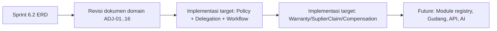

# ServiceKU — Recommendation (untuk Sprint 6.2)

> **Sprint 6.1A · Blueprint Validation.** Rekomendasi hasil validasi — menjadi **panduan masuk ke Sprint 6.2 (ERD)**.
> Prinsip: JANGAN menambah solusi baru bila domain sudah mampu; hanya catat yang benar-benar perlu.

---

## 1. Verdict

**Domain Model LULUS quality gate.** Layak menjadi dasar ERD (Sprint 6.2) — **dengan syarat** menerapkan penyesuaian additive pada ADJ-01..ADJ-16.

| Verdict | Kondisi |
|---|---|
| ✅ **LULUS** | 20/20 Business Reality dapat ditangani (5 penuh, 12 revisi kecil, 3 target) |
| ⚠️ **Syarat** | ERD 6.2 harus **menampung 12 gap kecil** secara additive (P0) |
| 🟠 **Ditunda** | G13 (StockCluster/Gudang) = future (P2), jangan blokir 6.2 |

---

## 2. Rekomendasi untuk Sprint 6.2 (ERD)

### R1 — Terapkan penyesuaian P0 (ADJ-01..ADJ-11, ADJ-13, ADJ-14) saat mendesain ERD
- **ADJ-01** Visit→ServiceOrder **0..n** (multi-device visit).
- **ADJ-02/03** `PickupLocation` & `PartCostBearing` sebagai kolom/VO pada entitas servis & pemakaian part.
- **ADJ-04/05** atribut spesialisasi teknisi + capability partner.
- **ADJ-06/09** konsep Delegation & CorrectionRecord (untuk No-SPOF & Data Is Sacred).
- **ADJ-07** `ResolutionType` pada Claim.
- **ADJ-10** grade/variant produk (part upgrade).
- **ADJ-11** WorkOrder 0..n progresif.
- **ADJ-13** tabel `modules`/`features` **terpisah** dari business type (template = seeding).
- **ADJ-14** desain `policies` (tipe: compensation, warranty, pricing, human_error, commission).

### R2 — Prioritaskan engine kunci di desain ERD
1. **Policy** (policies + policy_rules) — fondasi banyak BR.
2. **Permission/Delegation** (permissions, role_permission, user_role, delegation) — No-SPOF & multi-role.
3. **Workflow** (transitions, hooks) — state machine terpusat.
4. **Finance aggregate** (rollup/aggregate table) — kinerja laporan.

### R3 — Jaga keputusan arsitektur yang tervalidasi
- **ERP Modular** (bukan business-type-driven) → module table terpisah; hybrid store = kombinasi modul (BR-008).
- **1 DB per tenant** tetap; tidak ada query lintas tenant.
- **Additive & backward compatible** → gap kecil ditampung tanpa migrasi besar.
- **Status resmi dipertahankan** (14 service, 5 payment, 4 subscription, 9 role, 5 business type).

### R4 — Yang TIDAK masuk 6.2 (jangan dibuat)
- **StockCluster/Gudang** (BR-005) → future (P2); desain `InventoryItem` agar siap scope branch/cluster.
- **Public API / Webhook / AI / Marketplace** → future (FutureExpansion).
- **Double-entry accounting formal** → future.
- Perubahan business type/role resmi → TIDAK (tetap sesuai spesifikasi).

### R5 — Dokumentasi
- Setelah ERD 6.2, revisi dokumen domain sesuai `ArchitectureAdjustment.md` §3.
- ERD harus melacak setiap entitas ke dokumen domain + keputusan (DecisionLog).

---

## 3. Urutan Kerja yang Disarankan (6.2+)

---

## 4. Risiko yang Dimitigasi

| Risiko | Mitigasi |
|---|---|
| Domain tidak menampung realita | 20/20 BR dipetakan; 0 TIDAK didukung |
| Perubahan merusak data lama | Semua additive; backward compatible |
| Kompleksitas berlebih | Engine target memakai "Configuration over Code"; kasus umum tetap Simple by Default |
| Single point of failure | Multi-owner + Delegation (ADJ-06) |
| Laporan lambat | Aggregate/rollup (ADJ-16) |
