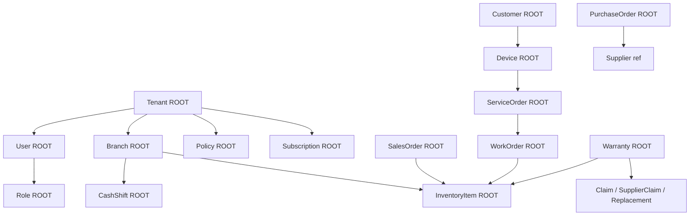

# ServiceKU — Aggregate

> **Sprint 6.1 · Blueprint Only.** Identifikasi **Aggregate Root** dan anggota (child) tiap aggregate. Modifikasi data hanya lewat root untuk menjaga **invariant** (konsistensi).
> Blueprint — tidak ada tabel/implementasi.

---

## 1. Prinsip Aggregate

1. **Aggregate Root** = pintu masuk satu-satunya untuk memodifikasi aggregate-nya.
2. **Invariant** (aturan yang tidak boleh dilanggar) dijaga di dalam aggregate.
3. Referensi antar aggregate memakai **ID** (bukan objek langsung) kecuali dalam konteks yang sama.
4. Perubahan aggregate menghasilkan **Domain Event** (lihat `DomainEvent.md`).
5. Ukuran aggregate dibuat **kecil & kohesif** — hindari aggregate raksasa.

---

## 2. Daftar Aggregate & Root

| Aggregate Root | Anggota (child) | Invariant penting |
|---|---|---|
| **Tenant** | Settings, BusinessType (value), Branding, Koneksi DB | 1 DB per tenant; business type resmi (4+1 source) |
| **Branch** | Inventory (per branch), Cash Register/Shift | stok & kas milik cabang; transfer harus bermutasi |
| **User** | Credentials, Position(s), Role(s) [target] | minimal 1 role; owner terakhir tidak bisa dihapus |
| **Role** | Permission (pivot) | role resmi 7; permission union saat multi-role |
| **Customer** | Customer Visit, Device | satu customer banyak device; histori tidak dihapus fisik |
| **Device** | Riwayat Service (referensi) | device berriwayat servis tidak dihapus |
| **ServiceOrder** | Work Order, Checklist, Photos, History/Timeline, Indent (referensi) | transisi status valid; 14 status; part dipakai harus tercatat |
| **WorkOrder** | Sparepart terpakai (referensi) | tidak ada WO tanpa induk ServiceOrder |
| **PurchaseOrder** | Purchase Item, Payment hutang | terima tanpa PO dilarang |
| **SalesOrder** | Sale Item, Payment | stok keluar hanya saat sukses; void → rollback |
| **CashShift** | Transaction, Deposit, Expense | shift tidak tumpang tindih; setoran dikonfirmasi |
| **Warranty** | Claim, Supplier Claim, Replacement | klaim dalam periode policy; replacement masuk stok |
| **Policy** | CompensationRule, WarrantyRule, PricingRule | aturan kompensasi mengikuti policy, bukan hardcode |
| **Subscription** | Plan (history), Voucher, Payment platform | status trial/active/expired/suspended; fitur sesuai plan |
| **InventoryItem** (Sparepart × Branch) | Stock Level, Movement | stok tidak negatif; setiap mutasi ada jejak |

---

## 3. Peta Aggregate (Ringkas)

> Child yang dicetak sebagai "referensi" bukan anggota aggregate — diakses via ID.

---

## 4. Aturan Modifikasi (Blueprint)

| Aggregate | Siapa boleh memodifikasi (via root) |
|---|---|
| Tenant | Super Admin (platform); Owner (pengaturan) |
| Branch | Owner (manage branch); Manager/Admin (operasional cabang) |
| User | Owner (`manage_users`); user (profil sendiri) |
| Role | Owner (target: manage role); platform (seed) |
| Customer | Owner/Admin/Manager/CS (`manage_customers`) |
| Device | CS/Admin/Manager/Owner |
| ServiceOrder | CS/Admin/Manager/Owner/Teknisi (`work_on_services`; assign: Owner/Admin/CS; void/delete: Owner/Admin) |
| WorkOrder | Teknisi/Admin/Manager/Owner |
| PurchaseOrder | Owner/Admin/Manager (`manage_purchases`) |
| SalesOrder | Kasir/Owner/Admin/Manager (`manage_sales`; void: Owner/Admin) |
| CashShift | Kasir/Owner/Admin/Manager (`manage_cash_register`; konfirmasi: Owner/Admin) |
| Warranty | Owner/Admin/Manager/CS (klaim); policy menentukan |
| Policy | Owner |
| Subscription | Owner (bayar/upgrade); Super Admin (override) |
| InventoryItem | Owner/Admin/Manager (`manage_products`; transfer: feature) |

---

## 5. Verifikasi

Aggregate didasarkan pada entitas nyata di source (Service, Customer, Device, Branch, User, Purchase, Sales, Cash/Deposit, Subscription, Plan, dll). Pemodelan root/child & invariant adalah **blueprint** — bukan skema database.
