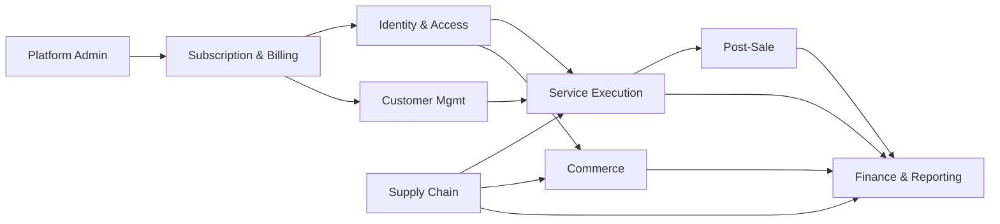

# ServiceKU — Bounded Context

> **Sprint 6.1 · Blueprint Only.** Strategi pemetaan domain ke konteks yang jelas batasnya. Setiap Bounded Context memiliki bahasa, model, dan aturan konsistensinya sendiri.
> Selaras dengan `docs/architecture-engine/ArchitectureDecision.md` (ERP Modular) dan `docs/specification/PROJECT_SPECIFICATION.md`.

---

## 1. Peta Bounded Context

| # | Bounded Context | Domain inti | Bahasa/Ubiquitous Language |
|---|---|---|---|
| BC1 | **Identity & Access** | User, Position, Role, Permission, Policy (akses), membership | role, permission, policy, position |
| BC2 | **Subscription & Billing** | Tenant (plan), Subscription, Module, Feature, Voucher, Payment platform | plan, trial, aktif, expired, suspended, feature, module |
| BC3 | **Customer Management** | Customer, Customer Visit, Device | pelanggan, kunjungan, perangkat, IMEI |
| BC4 | **Service Execution** | Service Order, Work Order, Service Partner, Checklist | tiket, status, teknisi, onpartner, indent |
| BC5 | **Supply Chain** | Sparepart, Supplier, Purchase, Inventory | stok, PO, supplier, mutasi, transfer |
| BC6 | **Commerce** | Sales (POS), Cash, Payment (tenant) | keranjang, nota, kasir, shift, setoran |
| BC7 | **Post-Sale** | Warranty, Compensation, Supplier Claim, Replacement | garansi, klaim, kompensasi, pengganti |
| BC8 | **Finance & Reporting** | Finance, Cash, Dashboard, Report, Monitoring | keuangan, laporan, profit, biaya |
| BC9 | **Platform Administration** | Super Admin, Tenant provisioning, Backup, Logs | tenant, backup, super admin |

---

## 2. Hubungan Antar Konteks (Context Map)

### Hubungan utama (Sumber → Konsumen, via event/API)
| Dari | Ke | Mekanisme |
|---|---|---|
| BC4 Service | BC5 Supply Chain | Event `SparepartUsed` → kurangi stok |
| BC6 Commerce | BC5 Supply Chain | Event `SaleCompleted` → kurangi stok |
| BC7 Post-Sale | BC5 Supply Chain | Event `ReplacementIssued` → tambah stok |
| BC4/BC6/BC7 | BC8 Finance | Event finansial → agregat keuangan |
| BC4 Service | BC7 Post-Sale | `ServiceOrderCompleted` → buka masa garansi |
| BC7 Post-Sale | BC4 Service | klaim → buat service order ulang (jika servis ulang) |

---

## 3. Aturan per Bounded Context

1. **Tidak ada akses langsung** ke model internal konteks lain — komunikasi via event/anti-corruption layer.
2. **BC4 Service Execution** adalah **Core Domain** (nilai bisnis utama) — prioritas kualitas tertinggi.
3. **BC2 Subscription** adalah **supporting** namun strategis (kontrol seluruh akses).
4. **BC8 Finance** adalah **generic/agregat** — mengkonsumsi event dari konteks lain.
5. Setiap konteks memiliki **permission & feature-nya sendiri** (map ke Module Engine).

---

## 4. Pemetaan Konteks ↔ Module (Saat Ini ↔ Target)

| Bounded Context | Modul (Sprint 5.1) | Status |
|---|---|---|
| Identity & Access | User & Role, Settings | ✅ ada |
| Subscription & Billing | Subscription/Billing, Tenant platform | ✅ ada |
| Customer Management | Customer | ✅ ada |
| Service Execution | Service, Servis Tools, Checklist, Indent | ✅ ada |
| Supply Chain | Inventory, Sparepart, Supplier, Pembelian | ✅ ada |
| Commerce | POS/Penjualan, Kasir & Kas, Setoran | ✅ ada |
| Post-Sale | Garansi, Kompensasi (target) | ⚠️ sebagian (garansi ada; kompensasi = target) |
| Finance & Reporting | Keuangan, Laporan, Monitoring, Dashboard | ✅ ada |
| Platform Administration | Tenant platform (Admin) | ✅ ada |

> **Perlu Verifikasi:** detail internal BC7 (Supplier Claim, Replacement) belum terekspos penuh di source — ditandai sebagai target.

---

## 5. Konsistensi & Anti-Corruption

- **Tenant isolation** berlaku lintas konteks: setiap konteks bekerja dalam scope tenant.
- **Business Reality chain** (Customer→Device→Service→Warranty→Claim→Replacement→Inventory→Finance→Compensation→Policy→Tenant) diwujudkan sebagai **event flow antar konteks**, bukan join silang.
- Bila dua konteks memakai istilah sama dengan makna berbeda (mis. "Payment" di BC2 vs BC6), gunakan **anti-corruption layer** dan penamaan eksplisit (`SubscriptionPayment` vs `SalePayment`).
