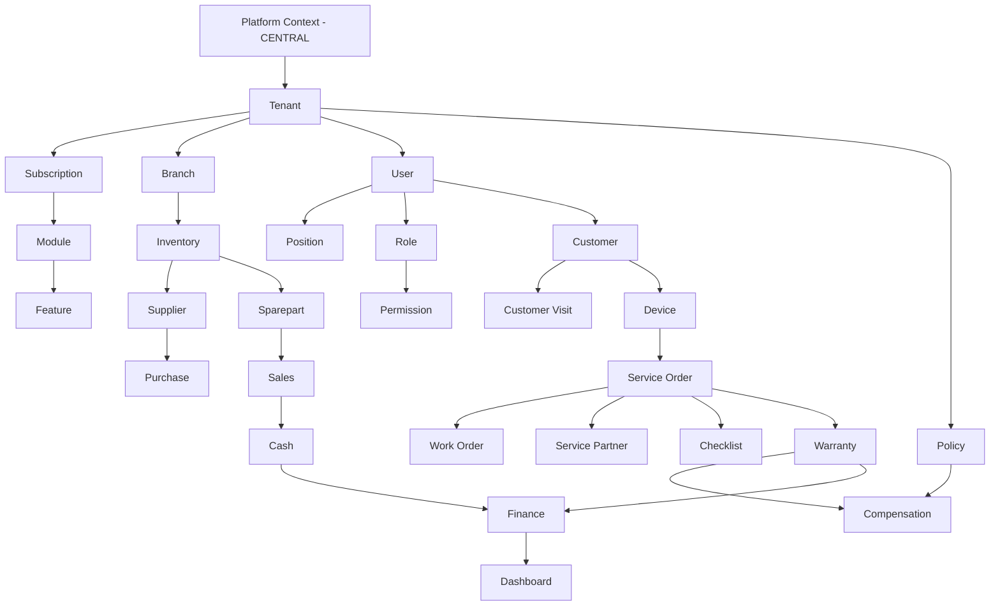
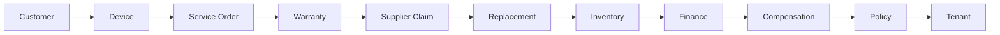

# ServiceKU — Core Domain Model

> **Sprint 6.1 · Blueprint Only.** Dokumen ini adalah **pondasi domain** ServiceKU — acuan seluruh backend, frontend, database, API, workflow, dashboard, permission, policy, dan reporting.
> **Status:** Blueprint. TIDAK ada kode, database, migration, controller, API, atau Vue yang dibuat.
> Dokumen tertinggi: `docs/specification/PROJECT_SPECIFICATION.md`. Selaras dengan: Sprint 4 (`docs/`), Sprint 5 (`docs/product/`), Sprint 5.1 (`docs/specification/`), Sprint 5.2 (`docs/architecture-engine/`), Business Reality (`RUNBOOK.md`, `CHECKLIST-OPERASIONAL-HARIAN.md`), Business Policy (aturan kompensasi/garansi per tenant).

---

## 1. Domain Overview

**ServiceKU** adalah platform SaaS ERP modular multi-tenant untuk bisnis servis elektronik, sparepart, aksesoris, gadget store, dan retail.

Domain model memodelkan **realita bisnis** berikut (Business Reality):

> *Customer* membawa *Device* masuk *Service Order* → device dikerjakan (Work Order / partner / indent sparepart) → selesai & bergaransi → garansi diklaim ke *Supplier* → *Supplier Claim* menghasilkan *Replacement* → replacement mempengaruhi *Inventory* → inventory mempengaruhi *Finance* → finance mempengaruhi *Compensation* → compensation mengikuti *Policy* → policy mengikuti *Tenant*.

Semua domain di bawah naungan **Tenant** (1 DB per tenant) kecuali domain platform (central: Tenant, Subscription, Payment platform, Super Admin). Domain berkomunikasi melalui **domain events** (bukan query silang lintas tenant).

### Prinsip Domain
1. **Tenant isolation** — setiap tenant memiliki ruang data sendiri; tidak ada query lintas tenant.
2. **Aggregate Root** — modifikasi data melewati root-nya; konsistensi dijaga per aggregate.
3. **Event-driven** — perubahan domain menghasilkan event; efek samping (inventory, finance, notifikasi) adalah reaksi terhadap event.
4. **Permission-centric** — akses domain lewat permission (role = kumpulan permission).
5. **Policy-driven** — aturan kompensasi/garansi mengikuti policy tenant, bukan hardcoded.
6. **Backward compatible** — blueprint tidak merusak kondisi saat ini; migrasi bertahap.

---

## 2. Domain Hierarchy

### Level Hierarchy
| Level | Konteks | Isi |
|---|---|---|
| **Platform** | Central | Tenant, Super Admin, Payment platform |
| **Tenant** | Tenant | Subscription, Module, Feature, Policy, Branch, User, Role |
| **Organisasi** | Tenant | Branch, User, Position, Role, Permission, Policy |
| **Relasi & Operasional** | Tenant | Customer, Visit, Device, Service Order, Work Order, Partner, Supplier, Inventory, Sparepart |
| **Transaksi** | Tenant | Sales, Purchase, Cash, Finance |
| **Pasca-Jual** | Tenant | Warranty, Compensation |
| **Wawasan** | Tenant | Dashboard, Report, Monitoring |
| **Platform-wide** | Central+Tenant | Finance (agregat), Subscription |

---

## 3. Analisis Domain Wajib (26 Domain)

> Format tiap domain: **Tujuan · Pemilik · Lifecycle · Relationship · Dependency · Tidak Boleh · Masa Depan**.

### 3.1 Tenant
- **Tujuan:** entitas teratas; pemilik seluruh data operasional; 1 database per tenant.
- **Pemilik:** Super Admin (platform) membuat; Owner mengelola pengaturan.
- **Lifecycle:** registrasi (OTP) → onboarding (business type) → aktif (trial) → berbayar/expired/suspended → nonaktif.
- **Relationship:** 1..n Branch, 1..n User, 1..1 Subscription, 1..n Policy, 1..n Customer; 1..1 Business Type (template).
- **Dependency:** Subscription (plan), Module (fitur aktif), central DB.
- **Tidak boleh:** tenant membaca data tenant lain; menghapus data tanpa arsip.
- **Masa depan:** kuota storage/API per tenant, custom domain, brand subdomain.

### 3.2 Branch
- **Tujuan:** unit operasional (cabang) dengan stok & kas sendiri.
- **Pemilik:** Owner (`canManageBranch`); plan Pro+ untuk multi-branch.
- **Lifecycle:** dibuat → aktif → (opsional) nonaktif/arsip.
- **Relationship:** 1..n User (assignment), 1..n Inventory, 1..n Cash Register/Shift, 1..n Sales/Service Order.
- **Dependency:** Tenant, Module `multi_branch`, `transfer_stock`.
- **Tidak boleh:** transfer stok tanpa mutasi tercatat; laporan cabang tanpa filter.
- **Masa depan:** lokasi geografis, jam buka per cabang, PIC cabang.

### 3.3 User
- **Tujuan:** pelaku (aktor) di dalam tenant.
- **Pemilik:** Owner (`canManageUsers`) membuat/mengubah; user mengelola profilnya.
- **Lifecycle:** diundang/dibuat → aktif → suspend/nonaktif → (target) multi-role.
- **Relationship:** 1..1 Branch (assignment, saat ini), 1..n Role (target many-to-many), 1..n Service Order (teknisi/CS), 1..n Sales (kasir).
- **Dependency:** Role/Permission, Tenant, plan `users`.
- **Tidak boleh:** user non-owner menghapus owner terakhir; user lintas tenant.
- **Masa depan:** multi-role (union permission), SSO, 2FA lanjutan, device session.

### 3.4 Position
- **Tujuan:** jabatan/posisi fungsional (mis. Kepala Toko, Teknisi Senior) — **pelengkap role**, bukan pengganti.
- **Pemilik:** Owner (target); saat ini posisi masih bagian dari data user/settings.
- **Lifecycle:** dibuat → aktif → nonaktif.
- **Relationship:** 1..n User.
- **Dependency:** Tenant, Role (permission disediakan role).
- **Tidak boleh:** position menggantikan permission (position = struktural, role = fungsional).
- **Masa depan:** hierarki posisi, laporan per posisi, approval oleh atasan.

### 3.5 Role
- **Tujuan:** kumpulan permission; 7 role resmi (Owner, Manager, Admin, CS, Kasir, Teknisi) + Super Admin (platform).
- **Pemilik:** Platform seed; owner dapat mengelola (target: role kustom).
- **Lifecycle:** seed → (target) buat/ubah/merge → nonaktif.
- **Relationship:** 1..n Permission (pivot), 1..n User.
- **Dependency:** Permission, Module (permission modul).
- **Tidak boleh:** hardcoded string `role` dalam logika aksi (target); menambah role resmi baru tanpa spesifikasi.
- **Masa depan:** role kustom, merge role, role template per business type.

### 3.6 Permission
- **Tujuan:** aturan akses atomik — pusat sistem (Permission-centric).
- **Pemilik:** Platform/Module registry (target: data).
- **Lifecycle:** didefinisikan oleh modul → di-assign ke role → (target) dikelola data.
- **Relationship:** 1..n Role (pivot); milik Module.
- **Dependency:** Module Engine, Feature.
- **Tidak boleh:** mengecek nama role di controller (target); permission tidak terdaftar.
- **Masa depan:** permission granular (baris/cabang), permission untuk API.

### 3.7 Policy
- **Tujuan:** aturan bisnis tenant — terutama **kompensasi**, garansi, harga, diskon, setoran.
- **Pemilik:** Owner; berlaku per tenant.
- **Lifecycle:** dibuat saat onboarding/template → aktif → revisi → nonaktif.
- **Relationship:** 1..n (kompensasi, garansi, harga); mengatur Compensation, Warranty.
- **Dependency:** Tenant, Business Type (template policy).
- **Tidak boleh:** aturan kompensasi hardcoded di kode (harus data policy).
- **Masa depan:** policy builder UI, versioning policy, policy per cabang.

### 3.8 Customer
- **Tujuan:** entitas pelanggan; sumber relasi servis & penjualan.
- **Pemilik:** Owner/Admin/Manager/CS (`manage_customers`).
- **Lifecycle:** dibuat → aktif → (target) inactive/blacklist → arsip.
- **Relationship:** 1..n Device, 1..n Customer Visit, 1..n Service Order, 1..n Sales.
- **Dependency:** Tenant, Module `customers`.
- **Tidak boleh:** duplikasi tanpa deteksi; menghapus customer berhistori tanpa arsip.
- **Masa depan:** segmentasi, poin/loyalitas, notifikasi WA, blacklist, kredit limit.

### 3.9 Customer Visit
- **Tujuan:** kunjungan pelanggan ke toko (basis pembuatan tiket servis).
- **Pemilik:** CS/Admin/Manager/Owner.
- **Lifecycle:** datang → dicatat → (bisa) menjadi Service Order → selesai.
- **Relationship:** 1..1 Customer, 1..n Device (dibawa), 1..0..1 Service Order.
- **Dependency:** Customer, Device.
- **Tidak boleh:** visit tanpa identitas customer; melewatkan catatan keluhan.
- **Masa depan:** antrian kunjungan, foto device saat datang, estimasi antrian.

### 3.10 Device
- **Tujuan:** perangkat milik customer (HP/laptop/MacBook/aksesoris) yang diservis.
- **Pemilik:** dihubungkan ke Customer; data device dikelola CS/Admin.
- **Lifecycle:** didaftarkan → aktif → (target) arsip/ganti pemilik.
- **Relationship:** 1..1 Customer, 1..n Service Order (riwayat servis).
- **Dependency:** Customer, Service Order.
- **Tidak boleh:** menghapus device berriwayat servis (soft/arsip); duplikasi device.
- **Masa depan:** IMEI/serial tracking, riwayat part yang terpasang, klaim garansi otomatis dari device.

### 3.11 Service Order
- **Tujuan:** **core domain** — tiket servis dengan 14 status (menunggu_alokasi → diambil/close).
- **Pemilik:** CS/Admin/Manager/Owner membuat; Teknisi mengerjakan (`work_on_services`).
- **Lifecycle:** 14 status → terminal (selesai/diambil/close/void/cancel). Lihat `DomainLifecycle.md`.
- **Relationship:** 1..1 Device, 1..1 Customer, 1..n Work Order, 1..n Checklist, 0..1 Service Partner, 0..1 Warranty, 1..n Service Photos/History.
- **Dependency:** Device, Customer, Inventory (sparepart), Indent, Permission (`work_on_services`, `assign_technician`), Feature `services`.
- **Tidak boleh:** mengubah status tanpa transisi valid; menghapus tiket berhistori; void tanpa owner/admin; service untuk business type retail.
- **Masa depan:** estimasi waktu selesai, SLA, push notifikasi status, self-service tracking pelanggan.

### 3.12 Work Order (optional)
- **Tujuan:** sub-pekerjaan di dalam Service Order (mis. bagian-bagian perbaikan / beberapa teknisi).
- **Pemilik:** Teknisi/Admin/Manager; dibentuk dari Service Order.
- **Lifecycle:** dibuka → dikerjakan → selesai/dibatalkan.
- **Relationship:** 1..1 Service Order, 1..1 Teknisi, 1..n Sparepart terpakai.
- **Dependency:** Service Order, Inventory.
- **Tidak boleh:** work order tanpa induk service order; menyelesaikan tanpa mencatat part.
- **Masa depan:** sub-kontrak, delegasi antarteknisi, tracking waktu kerja.

### 3.13 Service Partner
- **Tujuan:** pihak eksternal yang mengerjakan servis (dilempar) — status `onpartner`.
- **Pemilik:** Owner/Admin/Manager.
- **Lifecycle:** terdaftar → aktif → nonaktif.
- **Relationship:** 1..n Service Order (dilempar).
- **Dependency:** Tenant, Service Order.
- **Tidak boleh:** partner tanpa kontrak/komisi jelas; hilangnya jejak biaya partner.
- **Masa depan:** komisi partner, rating, tracking kirim balik.

### 3.14 Supplier
- **Tujuan:** pemasok sparepart/barang; sumber Purchase & Supplier Claim.
- **Pemilik:** Owner/Admin/Manager (`manage_purchases`).
- **Lifecycle:** terdaftar → aktif → nonaktif.
- **Relationship:** 1..n Purchase Order, 1..n Supplier Claim.
- **Dependency:** Tenant, Module `purchases`.
- **Tidak boleh:** hutang tanpa tercatat; claim tanpa purchase terkait.
- **Masa depan:** rating supplier, lead time, auto-reorder per supplier, negosiasi harga.

### 3.15 Inventory
- **Tujuan:** stok per branch; mutasi masuk/keluar/transfer/adjust.
- **Pemilik:** Owner/Admin/Manager (`manage_products` + feature `transfer_stock`).
- **Lifecycle:** barang masuk → tersedia → terpakai/transfer/reorder → (target) arsip.
- **Relationship:** 1..n Sparepart/Product, 1..1 Branch, 1..n Inventory Movement, 1..n Purchase (masuk), 1..n Sales (keluar), 1..n Replacement (masuk).
- **Dependency:** Branch, Purchase, Sales, Service Order (sparepart), Warranty (replacement), Module `products`, `transfer_stock`.
- **Tidak boleh:** stok negatif; mutasi tanpa jejak (audit); transfer tanpa approval.
- **Masa depan:** stok multi-gudang, batch/expiry, barcode/QR, forecasting.

### 3.16 Sparepart
- **Tujuan:** produk/part yang dijual & dipakai servis (bagian dari katalog Inventory).
- **Pemilik:** Owner/Admin/Manager (`manage_products`).
- **Lifecycle:** dibuat → aktif (stok) → reorder → (target) discontinued.
- **Relationship:** 1..n Inventory (per branch), 1..n Service Order (dipakai), 1..n Sales (dijual), 1..n Purchase.
- **Dependency:** Inventory, Supplier.
- **Tidak boleh:** harga tidak konsisten antar cabang (tanpa policy); stok menipis tanpa peringatan.
- **Masa depan:** part compatibility per device model, harga otomatis, bundling.

### 3.17 Sales
- **Tujuan:** transaksi penjualan (POS) — draft → selesai → pending → success/failed/expired → refunded/void.
- **Pemilik:** Kasir/Owner/Admin/Manager (`manage_sales`); void/delete Owner/Admin.
- **Lifecycle:** keranjang → simpan → bayar → lunas/refund/void. Lihat `DomainLifecycle.md`.
- **Relationship:** 1..n Sale Item (Sparepart), 1..1 Customer (opsional), 1..1 Cash Shift, 1..1 Branch.
- **Dependency:** Inventory (stok keluar), Cash, Feature `sales`.
- **Tidak boleh:** stok keluar tanpa transaksi sukses; void tanpa rollback stok & kas; delete transaksi lunas.
- **Masa depan:** split payment, layanan tambahan, retur parsial, e-invoice.

### 3.18 Purchase
- **Tujuan:** pembelian ke supplier; stok masuk; hutang.
- **Pemilik:** Owner/Admin/Manager (`manage_purchases`).
- **Lifecycle:** draft → PO → terima → hutang → bayar → close/void.
- **Relationship:** 1..n Purchase Item (Sparepart), 1..1 Supplier, 1..n Payment (hutang), 1..n Inventory Movement (masuk).
- **Dependency:** Supplier, Inventory, Finance.
- **Tidak boleh:** terima barang tanpa PO; bayar tanpa catat; void setelah diterima tanpa penyesuaian.
- **Masa depan:** auto-PO dari reorder, approval berjenjang, multi-currency.

### 3.19 Finance
- **Tujuan:** agregat keuangan tenant: pendapatan, biaya, hutang/piutang, profit, kompensasi.
- **Pemilik:** Owner/Admin/Manager (`manage_finance`).
- **Lifecycle:** terbentuk dari transaksi (sales/purchase/expense/deposit/kompensasi) → laporan periode.
- **Relationship:** terhubung ke Sales, Purchase, Cash, Expense, Compensation, Deposit.
- **Dependency:** seluruh modul transaksional; Module `expenses`, `deposits`.
- **Tidak boleh:** hitung ulang manual yang tidak sinkron dengan transaksi; mencatat biaya tanpa bukti.
- **Masa depan:** akuntansi double-entry formal, neraca, arus kas, pajak.

### 3.20 Cash
- **Tujuan:** kas & shift kasir, setoran harian.
- **Pemilik:** Kasir/Owner/Admin/Manager (`manage_cash_register`); konfirmasi setoran Owner/Admin.
- **Lifecycle:** buka shift → transaksi → tutup shift → setoran → konfirmasi.
- **Relationship:** 1..1 Branch, 1..n Sales, 1..n Deposit, 1..n Expense.
- **Dependency:** Sales, Finance, Module `cash_register`, `deposits`.
- **Tidak boleh:** selisih kas tanpa catatan; setoran tanpa konfirmasi; shift tumpang tindih.
- **Masa depan:** kas kecil multi, floating balance, rekonsiliasi otomatis.

### 3.21 Warranty
- **Tujuan:** jaminan pasca-servis dari tiket `selesai`.
- **Pemilik:** Owner/Admin/Manager/CS membuat klaim; policy menentukan periode.
- **Lifecycle:** aktif (dari service selesai) → klaim → diterima/ditolak → (jika supplier) Supplier Claim → replacement → selesai.
- **Relationship:** 1..1 Service Order, 1..n Claim, 1..n Supplier Claim, 1..n Replacement.
- **Dependency:** Service Order, Policy (durasi/syarat), Inventory (replacement), Supplier.
- **Tidak boleh:** klaim di luar periode tanpa approval; replacement tanpa mengurangi stok (via inventory).
- **Masa depan:** garansi berbayar, transfer garansi antar pemilik, reminder kadaluarsa.

### 3.22 Compensation
- **Tujuan:** kompensasi (ganti rugi) teknisi/karyawan berdasarkan policy tenant.
- **Pemilik:** Owner/Admin/Manager; dihitung oleh Compensation Engine mengikuti Policy.
- **Lifecycle:** event memicu → hitung → approval → (target) bayar → selesai.
- **Relationship:** 1..1 Policy (aturan), 1..1 Service Order (dasar), 1..1 User (penerima), 1..n Finance (biaya).
- **Dependency:** Policy, Finance, Service Order, Module (target: HR/kompensasi).
- **Tidak boleh:** kompensasi tanpa policy; perhitungan manual di luar sistem; menghilangkan jejak.
- **Masa depan:** skema komisi kompleks, payroll, slip kompensasi.

### 3.23 Dashboard
- **Tujuan:** wawasan operasional; dibangun berdasarkan permission (target).
- **Pemilik:** Owner/Manager/Admin (+ role dengan permission).
- **Lifecycle:** agregat dari data transaksi → widget → (target) kustomisasi.
- **Relationship:** mengkonsumsi Finance, Service, Inventory, Sales, Monitoring.
- **Dependency:** seluruh modul (agregasi); Feature `monitoring`, `reports`.
- **Tidak boleh:** widget di luar permission; data lambat (tanpa agregasi).
- **Masa depan:** widget builder, dashboard per role, export otomatis.

### 3.24 Subscription
- **Tujuan:** paket layanan tenant (trial/basic/pro/enterprise); status trial/active/expired/suspended.
- **Pemilik:** Super Admin (platform) & Owner (bayar/upgrade).
- **Lifecycle:** trial → active → expired/suspended → active lagi.
- **Relationship:** 1..1 Tenant, 1..n Voucher/Payment, 1..n Plan (history).
- **Dependency:** Plan, Payment platform, Module/Feature (kontrol).
- **Tidak boleh:** tenant expired mengakses fitur berbayar; override tanpa jejak.
- **Masa depan:** prorata, invoice otomatis, auto-renew, multi-tahun.

### 3.25 Module
- **Tujuan:** unit fungsional platform (registry) — Service, POS, Inventory, dst.
- **Pemilik:** Platform (registry); diaktifkan oleh plan.
- **Lifecycle:** didaftarkan → aktif (plan) → (target) pasang/lepas per tenant.
- **Relationship:** 1..n Feature, 1..n Permission, 1..n Menu.
- **Dependency:** Module Engine, Subscription.
- **Tidak boleh:** modul berjalan tanpa terdaftar; modul tanpa permission.
- **Masa depan:** marketplace modul, plugin, modul pihak ketiga.

### 3.26 Feature
- **Tujuan:** capability toggle per plan (full/read_only/none) — 17 feature keys saat ini.
- **Pemilik:** Platform (Feature Engine).
- **Lifecycle:** didefinisikan → di-scope plan/tenant → (target) toggle data.
- **Relationship:** 1..1 Module, 1..n Plan (level).
- **Dependency:** Module, Subscription.
- **Tidak boleh:** fitur tanpa enforcement server; toggle parsial (route ada tapi UI mati).
- **Masa depan:** A/B testing, feature per cabang, trial feature.

---

## 4. Business Reality Chain (Khusus)

Relasi utama yang wajib dijaga konsistensinya:

| Hubungan | Makna |
|---|---|
| Customer → Device | satu customer banyak device |
| Device → Service Order | satu device banyak riwayat servis |
| Service Order → Warranty | servis selesai berpotensi garansi |
| Warranty → Supplier Claim | klaim garansi ke supplier |
| Supplier Claim → Replacement | klaim diterima → barang pengganti |
| Replacement → Inventory | replacement masuk stok |
| Inventory → Finance | nilai stok & mutasi memengaruhi keuangan |
| Finance → Compensation | kompensasi adalah komponen biaya |
| Compensation → Policy | kompensasi dihitung mengikuti policy |
| Policy → Tenant | policy milik tenant |

Detail penuh: `DomainRelationship.md`.

---

## 5. Verifikasi & Konsistensi

- Seluruh status/role/business type/feature/plan mengikuti `docs/Naming.md`, `docs/specification/*`, dan source (Sprint 4/5).
- Domain **Baru** hanya boleh muncul lewat `FutureExpansion.md` + `ModuleEngine.md` (target).
- Blueprint ini **tidak** membuat database/tabel/ERD/source — murni model.
