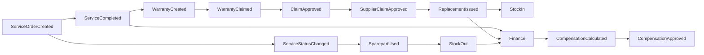

# ServiceKU — Domain Event

> **Sprint 6.1 · Blueprint Only.** **Domain Event** = fakta bisnis yang telah terjadi; menjadi dasar **integrasi antar Bounded Context**, efek samping, dan jejak audit.
> Blueprint — bukan implementasi (Queue/Jobs sudah ada di source untuk notifikasi/pdf).

---

## 1. Prinsip Domain Event

1. Event = **fakta masa lalu** (nama pakai past tense): `ServiceOrderCreated`.
2. **Satu aggregate → satu atau lebih event**; konsumen bereaksi (inventory, finance, notifikasi, audit).
3. Event adalah **sumber kebenaran untuk efek samping** — bukan panggilan langsung antar modul.
4. **Idempotent consumer** — reaksi tidak ganda jika event diproses ulang.
5. Dikaitkan dengan tenant & aggregate; dipakai juga untuk **activity log / history**.

---

## 2. Katalog Domain Event (Blueprint)

### Platform & Tenant
| Event | Pemicu | Reaksi |
|---|---|---|
| TenantRegistered | registrasi OTP | provisioning DB, onboarding template |
| TenantOnboarded | pilih business type & setup | aktifkan modul default |
| BusinessTypeChanged | owner ubah template | (target) sesuaikan modul |
| SubscriptionStarted | aktivasi plan | buka fitur sesuai plan |
| SubscriptionExpired | masa habis | batasi fitur |
| SubscriptionSuspended | gagal bayar/override | batasi akses |
| PlanChanged | upgrade/downgrade | perbarui limits/fitur |

### Organisasi & Akses
| Event | Pemicu | Reaksi |
|---|---|---|
| UserCreated | owner buat user | kirim undangan/OTP |
| UserSuspended | owner suspend | cabut akses |
| RolePermissionsChanged | owner edit role (target) | recompute permission |
| PolicyCreated / PolicyRevised | owner buat/revisi policy | aplikasikan ke kompensasi/garansi |

### Customer, Device, Service
| Event | Pemicu | Reaksi |
|---|---|---|
| CustomerCreated | buat customer | — |
| DeviceRegistered | daftar device | — |
| CustomerVisitRecorded | kunjungan dicatat | siapkan Service Order |
| ServiceOrderCreated | tiket dibuat | notifikasi, antrean |
| TechnicianAssigned | assign teknisi | notifikasi teknisi |
| ServiceStatusChanged | transisi status (14) | update UI, notifikasi pelanggan, log |
| SparepartUsed | part dipakai servis | kurangi stok |
| ServiceCompleted | selesai | buka masa garansi, hitung pendapatan |
| ServiceClosed | close/diambil/void | finalisasi |

### Inventory & Supply
| Event | Pemicu | Reaksi |
|---|---|---|
| StockIn | barang masuk (purchase/replacement/adjust +) | update stok, finance |
| StockOut | sale/servis/adjust − | update stok, finance |
| StockTransferred | transfer antar branch | update stok kedua branch |
| StockLow | stok ≤ threshold | peringatan reorder |
| PurchaseOrderReceived | terima PO | stok masuk, hutang tercatat |
| SupplierClaimApproved | claim supplier diterima | buat replacement |

### Commerce & Cash
| Event | Pemicu | Reaksi |
|---|---|---|
| SaleCompleted | pembayaran sukses | stok keluar, kas naik, nota |
| SaleVoided | void owner/admin | rollback stok & kas |
| PaymentStatusChanged | pending→success/failed/expired | update nota |
| Refunded | retur | rollback |
| CashShiftOpened / Closed | buka/tutup shift | kunci kas, hitung selisih |
| DepositCreated | setoran dibuat | antre konfirmasi |
| DepositConfirmed | owner/admin konfirmasi | finance tercatat |

### Pasca-Jual (Post-Sale)
| Event | Pemicu | Reaksi |
|---|---|---|
| WarrantyCreated | service selesai | mulai masa garansi |
| WarrantyClaimed | klaim garansi | evaluasi policy |
| ClaimApproved / ClaimRejected | hasil evaluasi | (approve) → supplier claim / servis ulang |
| SupplierClaimApproved | klaim supplier diterima | buat replacement |
| ReplacementIssued | replacement keluar | stok masuk, finance |
| CompensationCalculated | policy dihitung | biaya kompensasi → finance |
| CompensationApproved | approval | siap bayar |

### Wawasan
| Event | Pemicu | Reaksi |
|---|---|---|
| ReportGenerated | laporan dibuat | export/arsip |
| MonitoringEvent | aktivitas penting | feed monitoring |

---

## 3. Alur Business Reality (Event Flow)

---

## 4. Konsistensi Event (Target)

| Aspek | Ketentuan |
|---|---|
| Persistensi | event disimpan/auditable (activity log) — ServiceHistory & history sudah ada di source |
| Asinkron | Queue/Jobs (sudah ada) untuk notifikasi, pdf, email |
| Idempotensi | reaksi dicek ulang (mis. void hanya sekali rollback) |
| Outbox (target) | untuk integrasi webhook/public API di masa depan |

---

## 5. Verifikasi

Source sudah punya: Jobs (GenerateInvoicePdf), Notifications (OtpMail, TwoFactorCode), history servis, activity feed. Katalog event di atas adalah **blueprint** untuk menyatukan efek samping lintas modul secara konsisten.
