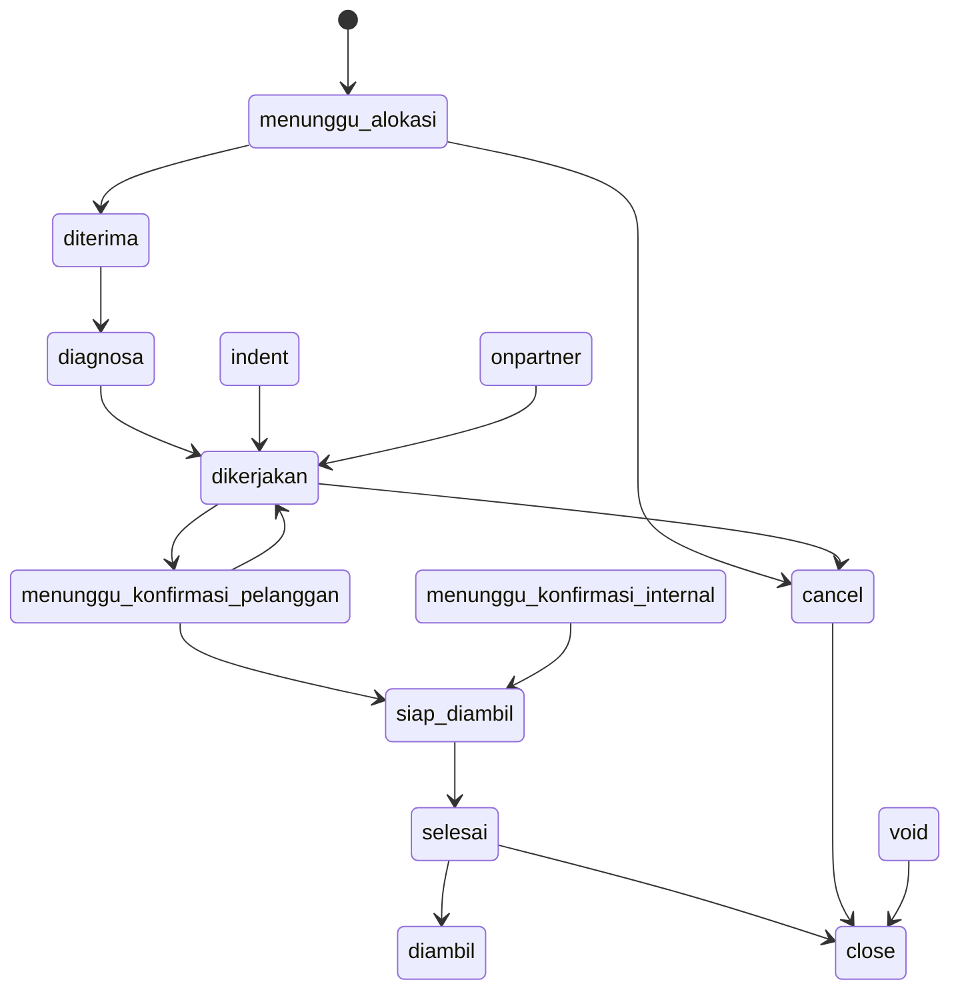
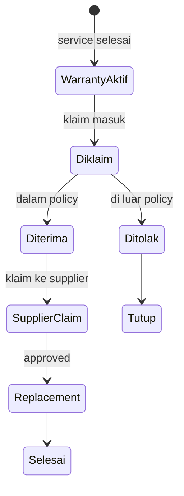

# ServiceKU — Domain Lifecycle

> **Sprint 6.1 · Blueprint Only.** Lifecycle (daur hidup) tiap domain penting: lahir → status aktif → terminal. Status diambil dari daftar resmi (`docs/Naming.md`, `docs/specification/WorkflowSpecification.md`).
> Blueprint — bukan implementasi.

---

## 1. Status Resmi (Sumber)

- **Service**: `menunggu_alokasi, diterima, diagnosa, dikerjakan, menunggu_konfirmasi_pelanggan, menunggu_konfirmasi_internal, siap_diambil, indent, onpartner, selesai, cancel, void, close, diambil` (14).
- **Payment**: `pending, success, failed, expired, refunded` (5).
- **Subscription**: `trial, active, expired, suspended` (4).
- **Business Type**: `full_service, aksesoris_service, aksespare_service, gadget_full, retail_only` (5).
- **Feature level**: `full, read_only, none`.

---

## 2. Lifecycle per Domain

### 2.1 Tenant & Subscription
```
[Registrasi] → trial (14 hari) → active → expired/suspended → active (perpanjang) → nonaktif/arsip
```
- Terminal: nonaktif/arsip (platform).

### 2.2 Branch
```
Dibuat → aktif → nonaktif (arsip)
```
- Tidak dihapus fisik; data stok/kas diarsipkan.

### 2.3 User
```
Dibuat/Diundang → aktif → suspended → aktif kembali → nonaktif
```
- Tidak dihapus fisik bila berhistori (teknisi/kasir).

### 2.4 Role & Permission
```
Seed (7 resmi) → (target) kustom: dibuat → aktif → nonaktif/merge
```

### 2.5 Policy
```
Template onboarding → aktif → revisi (versi baru) → nonaktif
```
- **Versioning**: revisi tidak menghapus versi lama (agar kompensasi historis tetap valid).

### 2.6 Customer & Device
```
Customer: dibuat → aktif → (target) inactive/blacklist → arsip
Device: didaftarkan → aktif → (target) ganti pemilik/arsip
```
- Berriwayat servis = tidak dihapus fisik.

### 2.7 Customer Visit
```
Datang → dicatat → (bisa) menjadi Service Order → selesai (tanpa order) atau tertutup
```

### 2.8 Service Order (Core — 14 status)

- Terminal: `diambil`, `close` (void/cancel juga berakhir di arsip close).

### 2.9 Work Order
```
Dibuka → dikerjakan → selesai / dibatalkan
```
- Selalu di dalam Service Order non-terminal.

### 2.10 Purchase Order
```
Draft → PO → diterima → hutang → dibayar → close; void (belum diterima)
```

### 2.11 Sales Order (POS)
```
Keranjang → draft → selesai → pending → success (lunas) → refunded
                               → failed/expired → void
```

### 2.12 Cash Shift & Deposit
```
Shift: buka → transaksi → tutup (hitung selisih) → final
Deposit: dibuat → menunggu konfirmasi → dikonfirmasi (finance) / ditolak
```

### 2.13 Inventory Item & Movement
```
Item: masuk stok → tersedia → habis → reorder → (target) discontinued
Movement: jejak permanen (masuk/keluar/transfer/adjust) — tidak pernah dihapus
```

### 2.14 Warranty → Claim → Supplier Claim → Replacement


### 2.15 Compensation
```
Event memicu → dihitung (policy) → menunggu approval → disetujui → dibayar → selesai
```

### 2.16 Module & Feature
```
Module: didaftarkan (registry) → aktif (plan) → (target) dipasang/dilepas tenant
Feature: didefinisikan → di-scope plan/tenant → on/off (full/read_only/none)
```

### 2.17 Dashboard & Report
```
Report: permintaan → dijalankan (agregasi) → hasil → export/arsip
Dashboard: agregat real-time/berkala → widget → kustomisasi (target)
```

---

## 3. Aturan Lifecycle

1. **Transisi valid** — tiap status hanya bisa berpindah via transisi yang diizinkan (Workflow Engine, target).
2. **Terminal state** — `diambil`, `close`, `void` (service); `success`+`refunded` (payment); `nonaktif` (user/branch); `selesai` (replacement/compensation) — tidak ada transisi keluar.
3. **Audit** — setiap transisi tercatat (ServiceHistory / activity log).
4. **Void vs Cancel** — void = batal (owner/admin, berimplikasi finansial); cancel = batal tanpa implikasi finansial.
5. Jangan membuat status baru di luar daftar resmi.

---

## 4. Verifikasi

Status service/payment/subscription/business type persis dari source & `docs/Naming.md`. Lifecycle lengkap di atas adalah **blueprint** konsolidasi (beberapa state machine masih tersebar di controller).
