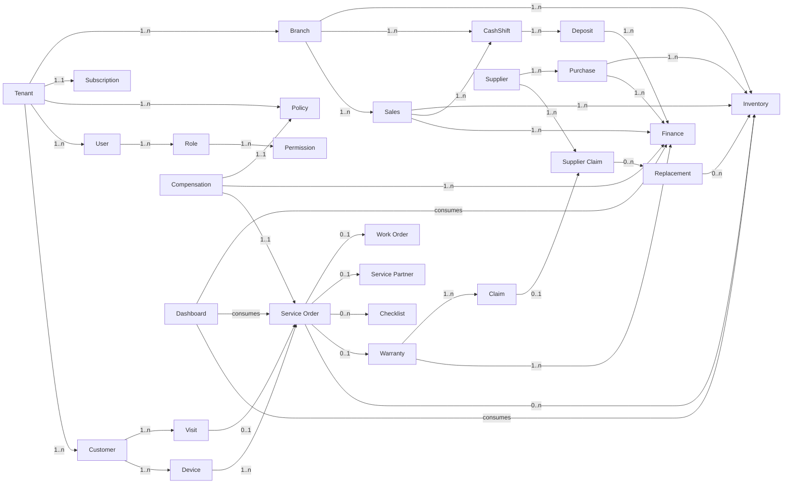

# ServiceKU — Domain Relationship

> **Sprint 6.1 · Blueprint Only.** Relasi antar domain (kardinalitas & semantik), termasuk **Business Reality chain** yang wajib dijaga.
> Blueprint — bukan ERD/tabel (dilarang pada sprint ini).

---

## 1. Peta Relasi Utama



---

## 2. Daftar Relasi Penting

| # | Relasi | Kardinalitas | Semantik |
|---|---|---|---|
| 1 | Tenant → Branch | 1..n | cabang milik tenant |
| 2 | Tenant → User | 1..n | user milik tenant (isolasi) |
| 3 | User → Role | 1..n (target; saat ini 1) | role menentukan permission |
| 4 | Role → Permission | 1..n | kumpulan permission |
| 5 | Tenant → Policy | 1..n | policy milik tenant |
| 6 | Customer → Device | 1..n | satu customer banyak perangkat |
| 7 | Device → Service Order | 1..n | banyak riwayat servis per perangkat |
| 8 | Visit → Service Order | 0..1 | kunjungan dapat menjadi tiket |
| 9 | Service Order → Work Order | 0..n | sub-pekerjaan |
| 10 | Service Order → Partner | 0..1 | dilempar ke partner (onpartner) |
| 11 | Service Order → Checklist | 0..n | checklist perangkat |
| 12 | Service Order → Warranty | 0..1 | selesai → berpotensi garansi |
| 13 | Warranty → Claim | 1..n | banyak klaim dalam satu garansi |
| 14 | Claim → Supplier Claim | 0..1 | klaim diteruskan ke supplier |
| 15 | Supplier Claim → Replacement | 0..n | klaim → barang pengganti |
| 16 | Replacement → Inventory | 0..n | pengganti masuk stok |
| 17 | Service Order → Inventory | 0..n | sparepart terpakai mengurangi stok |
| 18 | Sales → Inventory | 1..n | penjualan mengurangi stok |
| 19 | Purchase → Inventory | 1..n | pembelian menambah stok |
| 20 | Supplier → Purchase | 1..n | supplier sebagai pemasok |
| 21 | Supplier → Supplier Claim | 1..n | klaim ke supplier |
| 22 | Sales → CashShift | 1..n | transaksi dalam shift |
| 23 | CashShift → Deposit | 1..n | setoran dari shift |
| 24 | Sales/Purchase/Deposit/Compensation → Finance | 1..n | agregat keuangan |
| 25 | Compensation → Policy | 1..1 | kompensasi mengikuti policy |
| 26 | Compensation → Service Order | 1..1 | dasar kompensasi |
| 27 | Dashboard → modul | consume | wawasan dari agregasi |

---

## 3. Business Reality Chain (Wajib Dijaga)

```
Customer ──1..n──> Device ──1..n──> Service Order ──0..1──> Warranty
    Warranty ──1..n──> Claim ──0..1──> Supplier Claim ──0..n──> Replacement
        Replacement ──> Inventory ──> Finance ──> Compensation ──> Policy ──> Tenant
```

**Invariant rantai (tidak boleh dilanggar):**
1. Device hanya diservis untuk **customer pemiliknya** (atau transfer tercatat).
2. Service selesai → garansi aktif (sesuai policy).
3. Klaim garansi hanya dalam **periode policy**; di luar → ditolak.
4. Replacement **wajib** memengaruhi stok (masuk/keluar) — tidak boleh "hilang".
5. Setiap mutasi stok & kas **mempengaruhi finance** secara konsisten.
6. Compensation **hanya** dihitung jika ada policy; nilai mengikuti policy.
7. Policy **milik tenant** — tidak berlaku lintas tenant.

---

## 4. Aturan Relasi

1. Referensi antar aggregate memakai **ID** (bukan objek lintas konteks).
2. Relasi lintas bounded context dijaga via **event** (bukan query join silang).
3. Kardinalitas di atas adalah kontrak; perubahan wajib lewat dokumen ini + Module Engine.
4. Jangan membuat relasi baru tanpa mendokumentasikan semantik & invariant-nya.

---

## 5. Verifikasi

Relasi inti (Customer–Device–Service–Warranty–Inventory–Finance, Branch–Inventory–Cash, Supplier–Purchase) sesuai source & Business Reality. Relasi Compensation–Policy dan Replacement–Inventory adalah **target/blueprint** (sebagian belum utuh di source).
