# 01 — Enterprise Conceptual ERD

> **Sprint 6.2C · Conceptual Blueprint Only.** Peta entity-relationship ServiceKU — acuan tunggal untuk seluruh database, migration, model, repository, API, query, report, dan dashboard.
> **Status: Conceptual ERD.** Bukan physical DB, bukan SQL, bukan migration.

---

## 1. Arsitektur Entity (5 Layer — dari Sprint 6.2A)

```mermaid
flowchart TD
    subgraph L1[L1: Platform - CENTRAL DB]
        TENANT[tenants]
        PLAN[plans]
        PLAN_FEAT[plan_features]
        VOUCHER[vouchers]
        PLAT_PAY[platform_payments]
        SUPERADMIN[super_admins]
    end

    subgraph L2[L2: Tenant Configuration - TENANT DB]
        BRANCH[branches]
        USER[users]
        ROLE[roles]
        PERM[permissions]
        ROLE_PERM[role_permission]
        USER_ROLE[user_role]
        POSITION[positions]
        POLICY[policies]
        TENANT_SET[tenant_settings]
        PROVIDER_CRED[provider_credentials]
        MODULE_ACT[module_activations]
    end

    subgraph L3[L3: Master Data - TENANT DB]
        CUSTOMER[customers]
        DEVICE[devices]
        SUPPLIER[suppliers]
        PARTNER[service_partners]
        PRODUCT[products]
    end

    subgraph L4[L4: Transactional - ENTRY via REQUEST]
        REQUEST[requests]
        REQ_HIST[request_history]
        SVC[service_orders]
        WORK_ORD[work_orders]
        CHECKLIST[checklists]
        TECH_ASSIGN[technician_assignments]
        ATTACH[attachments]
        SALES[sales_orders]
        SALE_ITEMS[sale_items]
        PURCH[purchase_orders]
        PURCH_ITEMS[purchase_items]
        CASH_SHIFT[cash_shifts]
        DEPOSIT[deposits]
        EXPENSE[expenses]
        INV_ITEM[inventory_items]
        INV_MOVE[inventory_movements]
    end

    subgraph L5[L5: Post-Sale + Aggregate + Archive]
        WARRANTY[warranties]
        CLAIM[warranty_claims]
        SUPPLIER_CL[suplier_claims]
        REPLACE[replacements]
        COMPENSATION[compensations]
        FINANCE[finance_transactions]
        NOTIF[notifications]
        AUDIT[audit_logs]
        HISTORY[history_logs]
        DASH_WIDGET[dashboard_widgets]
        REPORT_SNAP[report_snapshots]
        SUBSCRIPTION[subscriptions]
        SUB_HIST[subscription_history]
    end

    L1 --- L2
    L2 --- L3
    L3 --- L4
    L4 --- L5
```



---

## 2. Prinsip Desain ERD

| Prinsip | Implementasi ERD |
|---|---|
| **Request = Core Entry Point** (ADR-001) | `requests.id` → FK `request_id` di `service_orders`, `sales_orders`, `warranty_claims` |
| **1 DB per Tenant** | Semua tabel L2–L5 di tenant DB; L1 di central DB |
| **Data Is Sacred** | Tidak ada hard delete untuk tabel transaksional (soft delete `deleted_at`) |
| **Append-only movement** | Inventory = `inventory_movements` (tidak update qty langsung) |
| **Policy as data** | `policies` dengan versioning; kompensasi/garansi/harga = policy |
| **Multi-role target** | `user_role` pivot (saat ini 1 kolom `role`; target many-to-many) |
| **Additive design** | Semua FK nullable untuk backward compatibility (data existing tanpa `request_id`) |
| **Amount in sen** | Semua kolom amount = bigint (integer, Rp terkecil) |

---

## 3. Konvensi Penamaan (dari Sprint 6.2A §18)

| Objek | Konvensi | Contoh |
|---|---|---|
| Tabel | snake_case jamak | `requests`, `service_orders`, `sale_items` |
| PK | `id` | UUID atau BigInt |
| FK | `<entity>_id` | `request_id`, `customer_id`, `branch_id` |
| Pivot | `<a>_<b>` alfabetis | `user_role`, `role_permission` |
| Timestamps | `created_at`, `updated_at`, `deleted_at` | — |
| Status | `status` (string) | `'menunggu_alokasi'` |
| Amount | `<name>_amount` (bigint) | `total_amount`, `cost_amount` |

---

## 4. Daftar Entity (Konseptual)

| # | Entity | Layer | Aggregate Root? | Wajib? |
|---|---|---|---|---|
| 1 | `tenants` | L1 Platform | ✅ Root | ✅ |
| 2 | `plans` | L1 Platform | ✅ Root | ✅ |
| 3 | `plan_features` | L1 Platform | Child of Plan | ✅ |
| 4 | `vouchers` | L1 Platform | ✅ Root | Opsional |
| 5 | `platform_payments` | L1 Platform | Child of Tenant | Opsional |
| 6 | `super_admins` | L1 Platform | ✅ Root | ✅ |
| 7 | `branches` | L2 Config | ✅ Root | ✅ (min. 1) |
| 8 | `users` | L2 Config | ✅ Root | ✅ |
| 9 | `roles` | L2 Config | ✅ Root | ✅ |
| 10 | `permissions` | L2 Config | ✅ Root (registry) | ✅ |
| 11 | `role_permission` | L2 Config | Pivot | ✅ |
| 12 | `user_role` | L2 Config | Pivot (target) | ✅ |
| 13 | `positions` | L2 Config | ✅ Root | Opsional (target) |
| 14 | `policies` | L2 Config | ✅ Root | Opsional (target) |
| 15 | `tenant_settings` | L2 Config | Child of Tenant | ✅ |
| 16 | `provider_credentials` | L2 Config | Child of Tenant | Opsional |
| 17 | `module_activations` | L2 Config | Child of Tenant | ✅ |
| 18 | `customers` | L3 Master | ✅ Root | ✅ |
| 19 | `devices` | L3 Master | ✅ Root | ✅ |
| 20 | `suppliers` | L3 Master | ✅ Root | Opsional |
| 21 | `service_partners` | L3 Master | ✅ Root | Opsional |
| 22 | `products` | L3 Master | ✅ Root | Opsional |
| 23 | `requests` | L4 Trans | ✅ Root | ✅ |
| 24 | `request_history` | L4 Trans | Child of Request | ✅ |
| 25 | `service_orders` | L4 Trans | ✅ Root | ✅ (setelah fork) |
| 26 | `work_orders` | L4 Trans | Child of ServiceOrder | Opsional (target) |
| 27 | `checklists` | L4 Trans | Child of ServiceOrder | Opsional |
| 28 | `technician_assignments` | L4 Trans | Child of ServiceOrder | Opsional |
| 29 | `attachments` | L4 Trans | Child (polymorphic) | Opsional |
| 30 | `sales_orders` | L4 Trans | ✅ Root | Opsional |
| 31 | `sale_items` | L4 Trans | Child of SalesOrder | ✅ (jika sales) |
| 32 | `purchase_orders` | L4 Trans | ✅ Root | Opsional |
| 33 | `purchase_items` | L4 Trans | Child of PurchaseOrder | ✅ (jika purchase) |
| 34 | `cash_shifts` | L4 Trans | ✅ Root | Opsional |
| 35 | `deposits` | L4 Trans | Child of CashShift | Opsional |
| 36 | `expenses` | L4 Trans | ✅ Root | Opsional |
| 37 | `inventory_items` | L4 Trans | ✅ Root (per branch×product) | ✅ |
| 38 | `inventory_movements` | L4 Trans | Child of InventoryItem | ✅ |
| 39 | `warranties` | L5 Post-Sale | ✅ Root | Opsional (dari service selesai) |
| 40 | `warranty_claims` | L5 Post-Sale | Child of Warranty | Opsional |
| 41 | `suplier_claims` | L5 Post-Sale | Child of Claim | Opsional |
| 42 | `replacements` | L5 Post-Sale | Child of SuplierClaim | Opsional |
| 43 | `compensations` | L5 Post-Sale | ✅ Root | Opsional (target) |
| 44 | `finance_transactions` | L5 Aggregate | ✅ Root (aggregate) | ✅ |
| 45 | `notifications` | L5 Aggregate | ✅ Root | Opsional |
| 46 | `audit_logs` | L5 Log | Append-only | ✅ |
| 47 | `history_logs` | L5 Log | Append-only | Opsional |
| 48 | `dashboard_widgets` | L5 Config | Child of User | Opsional |
| 49 | `report_snapshots` | L5 Config | ✅ Root | Opsional |
| 50 | `subscriptions` | L5 Billing | ✅ Root | ✅ |
| 51 | `subscription_history` | L5 Billing | Child of Subscription | ✅ |
| 52 | `customer_visits` | L3 Legacy | ✅ Root | Legacy (didepresiasi) |

---

## 5. Origin Trace (ADR-001)

```
requests.id ──FK──> service_orders.request_id (immutable, nullable for legacy)
             ──FK──> sales_orders.request_id
             ──FK──> warranty_claims.request_id (via warranties.service_order_id → service_orders.request_id)
```

---

## 6. Aturan Konseptual

1. **Setiap tabel transaksional (L4)** punya FK `request_id` — nullable untuk data existing.
2. **Pivot tables** untuk relasi many-to-many: `user_role`, `role_permission`.
3. **Polymorphic attachments** — `attachments` bisa milik Request, ServiceOrder, Product, dll.
4. **Inventory = append-only** — `inventory_items.qty` adalah view/aggregate dari `inventory_movements`.
5. **Policy = versioned** — `policies` dengan `version` + `valid_from`/`valid_to`.
6. **Soft delete** — semua tabel L3/L4/L5 memiliki `deleted_at` (lihat Sprint 6.2A §10).

---

## 7. Verifikasi

Selaras dengan: ADR-001 (Sprint 6.1D), Data Architecture (Sprint 6.2A), Integration Architecture (Sprint 6.2B), Domain Model (Sprint 6.1), Validation (Sprint 6.1A).
