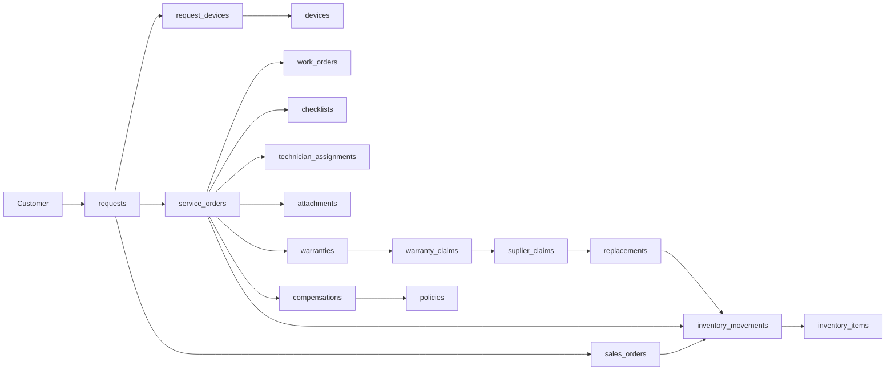

# 06 — Request Flow (Origin Trace)

> **Sprint 6.2C · Conceptual Blueprint.** Bagaimana Request mengalir melalui ERD — dari lahir hingga archive.

---

## 1. Flow Utama



---

## 2. Origin Trace (ADR-001)

```
requests.id
    ├── service_orders.request_id      (immutable)
    │       ├── work_orders.service_order_id
    │       ├── warranties.service_order_id
    │       │       └── warranty_claims.warranty_id
    │       │               └── suplier_claims.warranty_claim_id
    │       │                       └── replacements.suplier_claim_id
    │       └── compensations.service_order_id
    ├── sales_orders.request_id
    │       └── sale_items.sales_order_id
    ├── request_history.request_id    (append-only)
    ├── attachments (polymorphic)
    └── notifications (polymorphic)
```

**Setiap baris transaksional dapat ditelusuri kembali ke `requests.id`**. Origin trace ini adalah `request_id` yang immutable — tidak bisa diubah setelah fork.

---

## 3. Fork Points

| Fork | Dari | Ke | Kapan |
|---|---|---|---|
| **Request → ServiceOrder** | `requests.status='processing'` | `service_orders` (status=`menunggu_alokasi`) | Setelah Request di-assign & device diterima |
| **Request → SalesOrder** | `requests.status='processing'` | `sales_orders` | Walk-in retail / beli sparepart |
| **ServiceOrder → Warranty** | `service_orders.status='selesai'` | `warranties` | Otomatis jika service selesai |
| **WarrantyClaim → SuplierClaim** | `warranty_claims.resolution='supplier_claim'` | `suplier_claims` | Jika klaim diteruskan ke supplier |
| **SuplierClaim → Replacement** | `suplier_claims.status='approved'` | `replacements` | Claim disetujui |

---

## 4. Cascade Rules

| Aksi pada Request | Dampak ke turunan |
|---|---|
| Request `cancelled` | Semua ServiceOrder & SalesOrder yang sudah di-fork → **soft delete** (cascade). Jika sudah `processing`, perlu reversal (BR-015). |
| Request `closed` | Tidak ada dampak; turunan sudah terminal. |
| Request `deleted` (soft) | Cascade soft delete ke semua turunan. |

---

## 5. Aturan Flow

1. **Tidak boleh ada ServiceOrder/SalesOrder/Warranty tanpa `request_id`** — kecuali data legacy (nullable).
2. **`request_id` immutable** — tidak bisa di-update setelah di-set.
3. **Fork bersifat idempotent** — satu Request tidak bisa fork ke ServiceOrder yang sama dua kali.
4. **Turunan berjalan mandiri** — setelah fork, ServiceOrder punya lifecycle sendiri (14 status).

---

## 6. Verifikasi

Konsisten dengan ADR-001 (Sprint 6.1D), `docs/request-engine/03_RequestRelationship.md`, `docs/data-architecture/01_DataArchitecture.md` (Layer 4 → Layer 5).
