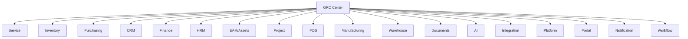

# GRC Architecture — Governance, Risk, Compliance & Audit Center

> **Sprint 34.0** — Nineteenth ERP module. All governance, risk, compliance, and audit processes route through here.

---

## 🏗️ Architecture

```
GRC Center (ALL GRC processes route through here — zero siloed GRC logic)
├── GRC Workspace             → Workspace Engine (16 tabs)
├── Risk Register             → Data Engine (10 cols, 4 filters, 4 bulk actions)
├── Audit Findings            → Data Engine (9 cols, 3 filters, 3 bulk actions)
├── CAPA                      → Data Engine (9 cols, 2 filters, 3 bulk actions)
├── Incidents                 → Data Engine (8 cols, 2 filters, 4 bulk actions)
├── Internal Controls         → Data Engine (8 cols, 2 filters, 2 bulk actions)
├── Compliance Matrix         → Data Engine (7 cols, 2 filters, 2 bulk actions)
├── Automation Engine         → 15 rules (risk created, escalated, audit scheduled, finding, CAPA, incident, control failed, fraud detection, etc.)
├── Reporting Engine          → 12 reports
└── ALL 18 modules            → Service, Inventory, Purchasing, CRM, Finance, HRM, EAM, Project, POS, MFG, WMS, DMS, AI, Integration, Platform, Portal, Notification, Workflow
```

---

## 🛡️ Workspace (16 tabs)

| Tab | Content |
|-----|---------|
| Executive Overview | Governance score, critical risks, compliance %, open findings, overdue CAPA, incidents MTD |
| Risk Register | Enterprise risk inventory with 5×5 matrix scoring |
| Risk Assessment | Qualitative + quantitative risk evaluation (likelihood × impact) |
| Compliance Matrix | ISO 9001, ISO 27001, PSAK, Tax, BPJS, Labor, Internal compliance tracking |
| Internal Audit | Audit plans, schedules, audit programs, evidence collection |
| External Audit | External auditor management, reports, recommendations |
| Findings | All audit findings (internal + external), severity classification |
| CAPA | Corrective & Preventive Actions with effectiveness tracking |
| SOP & Policies | Standard operating procedures, policy library, version control |
| Regulatory Requirements | Regulatory obligation register with compliance mapping |
| Internal Controls | Control catalog with testing schedules and effectiveness ratings |
| Incident Management | Incident reporting, investigation, root cause, resolution |
| Governance Dashboard | Board-level governance scorecard and KPIs |
| AI Risk Advisor | AI-powered risk predictions, fraud detection, anomaly alerts |
| Audit Trail | Immutable GRC audit log |
| Settings | Risk matrix configuration, compliance frameworks, notification rules |

---

## 🔗 ALL 18 Modules Route Through Here



---

## 📊 Core Models

| Model | Table | Purpose |
|-------|-------|---------|
| Risk | `risks` | Enterprise risk register with scoring |
| AuditFinding | `audit_findings` | Internal + external audit findings |
| CAPA | `capas` | Corrective & Preventive Actions |
| Incident | `incidents` | Incident reporting and management |
| InternalControl | `internal_controls` | Control catalog and testing |
| ComplianceRequirement | `compliance_requirements` | Regulatory and standards compliance |

---

## 🎯 Risk Matrix (5×5)

| Likelihood ↓ / Impact → | 1-Very Low | 2-Low | 3-Medium | 4-High | 5-Very High |
|--------------------------|------------|-------|----------|--------|-------------|
| 5-Almost Certain         | 5 Medium   | 10 High | 15 High | 20 Critical | 25 Critical |
| 4-Likely                 | 4 Medium   | 8 Medium | 12 High | 16 Critical | 20 Critical |
| 3-Possible               | 3 Low      | 6 Medium | 9 Medium | 12 High | 15 High |
| 2-Unlikely               | 2 Low      | 4 Low | 6 Medium | 8 Medium | 10 High |
| 1-Rare                   | 1 Low      | 2 Low | 3 Low | 4 Medium | 5 Medium |

---

*GRC Architecture — Sprint 34.0*
