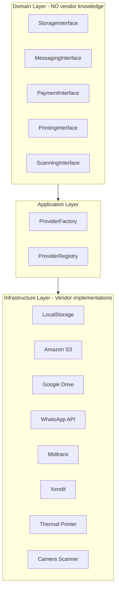

# 01 — Integration Architecture

> **Sprint 6.2B · Blueprint Only.** Arsitektur integrasi eksternal ServiceKU. Seluruh integrasi menggunakan **Provider Pattern** — domain tidak pernah tahu vendor.
> **Prinsip utama:** "Tenant tidak boleh terkunci pada satu vendor."

---

## 1. Filosofi

```
Domain menentukan APA yang dibutuhkan.
Provider menentukan BAGAIMANA melakukannya.
Tenant memilih SIAPA vendornya.
```

Setiap integrasi eksternal (storage, messaging, payment, printing, scanning, AI, marketplace, location, notification, backup) adalah **interface** di layer domain dan **implementation** di layer infrastructure.

---

## 2. Arsitektur Provider



---

## 3. Prinsip Provider Pattern

| Prinsip | Implementasi |
|---|---|
| **Domain tidak tahu vendor** | Domain hanya memanggil `StorageInterface.store(file)`. Tidak pernah `S3Client.upload()`. |
| **Tenant memilih provider** | Via Settings/Policy; tidak hardcode. |
| **Fallback chain** | Jika provider utama gagal → fallback. (OfflineStrategy) |
| **Swap tanpa kode** | Ganti dari Google Drive ke S3 = ubah setting, bukan deploy. |
| **Multi-provider** | Satu tenant bisa pakai >1 storage (foto ke S3, invoice ke Google Drive). |
| **Provider baru = registry** | Daftarkan provider baru di registry; tidak ubah domain. |

---

## 4. Peta Provider (13 tipe)

| # | Provider Type | Interface | Fungsi | Contoh vendor |
|---|---|---|---|---|
| 1 | **Storage** | `StorageInterface` | Simpan file/foto/dokumen | Local, S3, Google Drive, R2, NAS |
| 2 | **Messaging** | `MessagingInterface` | Kirim/terima pesan (WA, SMS) | WhatsApp API, Evolution API, Email |
| 3 | **Printing** | `PrintingInterface` | Cetak nota/invoice/label | Browser, Thermal USB, Network |
| 4 | **Scanning** | `ScanningInterface` | Scan barcode/QR/IMEI | Kamera HP, USB Scanner, Bluetooth |
| 5 | **Payment** | `PaymentInterface` | Proses pembayaran | Cash, QRIS, Midtrans, Xendit |
| 6 | **Marketplace** | `MarketplaceInterface` | Sinkron order/produk | Tokopedia, Shopee, TikTok Shop |
| 7 | **Location** | `LocationInterface` | Geocoding, maps, distance | Google Maps, OpenStreetMap |
| 8 | **Notification** | `NotificationInterface` | Kirim notifikasi ke user | Browser, Email, SMS, Push |
| 9 | **Backup** | `BackupInterface` | Backup & restore database | Local, S3, R2, NAS |
| 10 | **AI** | `AIInterface` | Klasifikasi, rekomendasi, chat | OpenAI, Gemini, DeepSeek |
| 11 | **Auth** | (Laravel Socialite) | OAuth login | Google, Facebook (existing) |
| 12 | **Email** | `MailInterface` | Kirim email transaksional | Brevo (existing), SES, Mailgun |
| 13 | **Queue** | (Laravel Queue) | Background jobs | Redis, Database (existing) |

---

## 5. Provider Registry

```
ProviderRegistry {
    'storage': {
        'local': LocalStorageProvider,
        's3': S3StorageProvider,
        'google_drive': GoogleDriveProvider,
        'r2': R2StorageProvider,
        'nas': NASStorageProvider,
    },
    'payment': {
        'cash': CashPaymentProvider,
        'midtrans': MidtransProvider,
        'xendit': XenditProvider,
    },
    ...
}
```

- Registry = data (config / DB) — bukan hardcode.
- Provider baru = daftarkan di registry + implement interface.
- Tenant memilih provider dari registry via Settings.

---

## 6. Dependency Injection (Konsep)

```php
// Domain — tidak tahu vendor
class AttachmentService {
    public function __construct(
        private StorageInterface $storage,  // ← interface, bukan class concrete
    ) {}

    public function uploadPhoto(ServiceOrder $order, File $photo): string {
        return $this->storage->store("services/{$order->id}", $photo);
    }
}

// Infrastructure — binding
// Tenant pakai S3 → bind(StorageInterface::class, S3StorageProvider::class)
// Tenant pakai Local → bind(StorageInterface::class, LocalStorageProvider::class)
```

---

## 7. Aturan Arsitektur

1. **Domain layer TIDAK BOLEH** mengimpor/menyebut nama vendor (`S3Client`, `WhatsAppSDK`).
2. **Interface** didefinisikan di `app/Contracts/` (domain).
3. **Implementasi** di `app/Providers/` (infrastructure) atau package composer.
4. **Tenant memilih** provider via Settings; disimpan di tenant DB.
5. **Fallback** otomatis — provider gagal → fallback ke provider cadangan (OfflineStrategy).
6. **Provider baru** = implement interface + daftar registry. Tidak ubah domain.

---

## 8. Verifikasi

Konsisten dengan prinsip **Configuration over Code**, **Vendor Independence**, **Grow Without Migration**, **Module over Business Type** (provider = modul opsional), `docs/architecture-engine/ModuleEngine.md` (Sprint 5.2).
