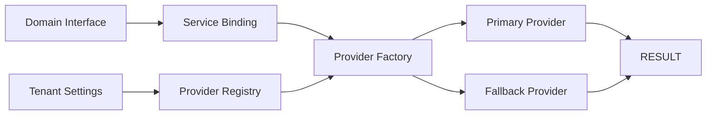

# 02 — Provider Pattern

> **Sprint 6.2B · Blueprint Only.** Detail Provider Pattern — kontrak, registry, factory, fallback, binding, dan aturan pengembangan.

---

## 1. Komponen Provider Pattern



| Komponen | Peran |
|---|---|
| **Interface** | Kontrak di domain layer — method yang harus diimplementasikan. |
| **Registry** | Daftar semua provider yang tersedia (key → class). |
| **Factory** | Membuat instance provider berdasarkan tenant settings. |
| **Binding** | Memetakan interface ke provider konkret via Service Container. |
| **Fallback Chain** | Jika provider utama gagal, coba provider berikutnya. |
| **Settings** | Tenant memilih provider mana yang aktif. |

---

## 2. Struktur Interface (Kontrak)

Setiap provider type memiliki interface dengan method minimal:

### StorageInterface
```php
store(path, file): string       // Simpan file, return URL/path
get(path): stream               // Ambil file
delete(path): void               // Hapus file
exists(path): bool               // Cek apakah file ada
url(path): string                // Dapatkan URL akses
quota(): int                     // Kuota terpakai (bytes)
```

### MessagingInterface
```php
send(to, message): MessageResult    // Kirim pesan
receive(webhook): Message            // Terima pesan masuk
isConnected(): bool                  // Status koneksi
getQR(): string                      // QR untuk pairing (WA Web)
disconnect(): void                   // Putus koneksi
```

### PaymentInterface
```php
createTransaction(order): PaymentUrl    // Buat transaksi, return URL bayar
checkStatus(transactionId): Status     // Cek status pembayaran
handleCallback(webhook): void          // Terima notifikasi pembayaran
refund(transactionId): void            // Refund
```

### PrintingInterface
```php
print(document, printer): PrintResult    // Cetak ke printer tertentu
getPrinters(): Printer[]                 // Daftar printer tersedia
preview(document): string                // Preview HTML
```

### ScanningInterface
```php
scan(type: 'barcode'|'qr'|'imei'): ScanResult    // Scan, return hasil
getDevices(): ScannerDevice[]                     // Daftar perangkat scan
```

### AIInterface
```php
classify(text, context): Classification      // Klasifikasi teks
suggest(context): Suggestion                 // Rekomendasi
chat(message, history): ChatResponse         // Chat/assistant
transcribe(audio): string                    // Transkripsi suara
```

---

## 3. Provider Factory (Konsep)

```
ProviderFactory::make('storage')
    → baca tenant.settings → storage.provider = 's3'
    → cek registry['storage']['s3'] = S3StorageProvider::class
    → resolve S3StorageProvider dengan credentials tenant
    → wrap dengan FallbackProvider(S3StorageProvider, LocalStorageProvider)
    → return instance
```

**Fallback chain:**
- Primary → Fallback1 → Fallback2 → Default (local/native)
- Jika S3 gagal → coba Google Drive → fallback ke Local Storage.

---

## 4. Tenant Settings (Blueprint)

```json
{
  "providers": {
    "storage": {
      "primary": "s3",
      "fallback": "local",
      "credentials": { "key": "...", "secret": "..." }
    },
    "messaging": {
      "primary": "whatsapp_web",
      "fallback": "email"
    },
    "payment": {
      "primary": "midtrans",
      "fallback": "cash"
    },
    "ai": {
      "primary": null,
      "fallback": null
    }
  }
}
```

---

## 5. Aturan Provider Pattern

1. **Satu interface = satu tanggung jawab** — jangan gabung storage + backup dalam satu interface.
2. **Interface stabil** — method tidak sering berubah; parameter via DTO (Data Transfer Object).
3. **Implementasi nihil** — provider yang tidak diaktifkan = no-op (tidak error, tidak melakukan apa-apa).
4. **Credential terenkripsi** — kunci API, token disimpan terenkripsi di tenant DB.
5. **Testing** — interface memudahkan mocking (LocalStorage, FakeMessaging, FakePayment).
6. **Provider baru** = buat class implement interface + daftarkan di registry.

---

## 6. Verifikasi

Konsisten dengan `01_IntegrationArchitecture.md`, prinsip **Configuration over Code**, **Vendor Independence**, **Simple by Default** (default = local/native provider tanpa konfigurasi), **Progressive Complexity** (provider berbayar = opsi lanjutan).
