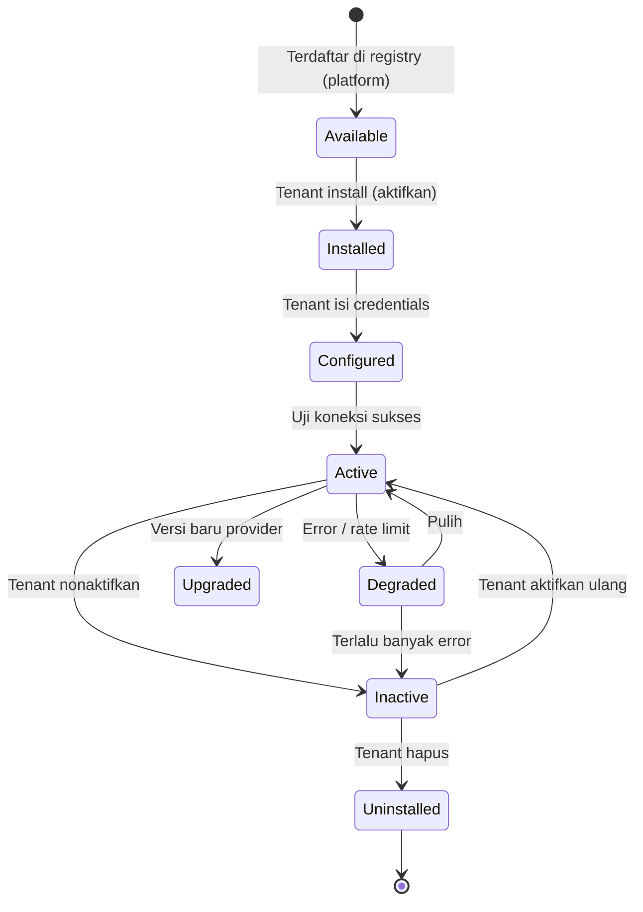

# 13 — Provider Lifecycle

> **Sprint 6.2B · Blueprint Only.** Siklus hidup provider — dari discovery hingga uninstall.

---

## 1. Lifecycle Provider

---

## 2. Tahap Detail

| Tahap | Deskripsi | Siapa |
|---|---|---|
| **Available** | Provider terdaftar di Platform Registry. | Platform (Super Admin / developer) |
| **Installed** | Tenant memilih provider dari daftar. | Owner / Admin |
| **Configured** | Tenant mengisi credential (API key, nomor WA, dll.). | Owner / Admin |
| **Active** | Provider berfungsi normal. | System |
| **Degraded** | Error rate tinggi atau rate limit tercapai. Auto-switch ke fallback. | System (auto) |
| **Inactive** | Tenant menonaktifkan; fallback mengambil alih. | Owner / Admin |
| **Upgraded** | Provider versi baru; migrasi credential jika perlu. | Platform |
| **Uninstalled** | Provider dihapus dari tenant; data credential dihapus. | Owner / Admin |

---

## 3. Health Check

Setiap provider memiliki method `healthCheck(): HealthStatus`:
- `ok` — berfungsi normal.
- `degraded` — lambat / rate limited.
- `error` — gagal total → auto fallback.

Health check dijalankan periodik (cron) + saat provider dipakai.

---

## 4. Aturan

1. **Default provider = always Active** — Local Storage, Browser Print, Cash, Kamera HP.
2. **Cloud provider = tenant aktifkan** — tidak otomatis aktif.
3. **Degraded → auto fallback** — tanpa notifikasi ke user (transparan).
4. **Error → fallback + notifikasi Owner** — agar tenant tahu provider bermasalah.
5. **Uninstalled → hapus credential** — data sensitif tidak tersisa.

---

## 5. Verifikasi

Konsisten dengan `02_ProviderPattern.md` (fallback chain), `16_OfflineStrategy.md`.
