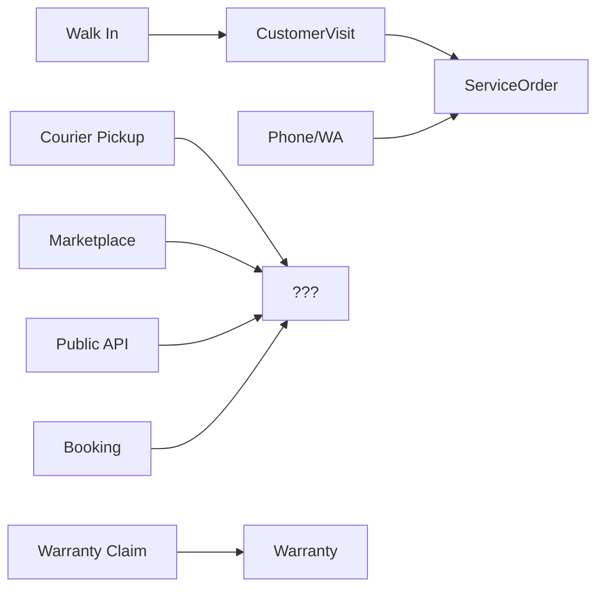
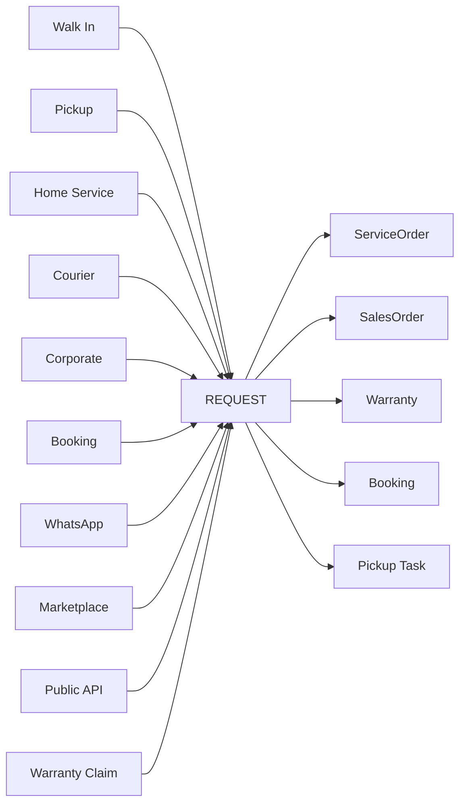

# 01 — Request Engine

> **Sprint 6.1D · Architecture Freeze · Blueprint Only.**
> Menetapkan **Request** sebagai Core Entry Point ServiceKU. Dokumen ini mendefinisikan apa itu Request, mengapa ia dibutuhkan, dan bagaimana ia bekerja sebagai engine.
> **Status: ARCHITECTURE FREEZE.** Setelah sprint ini, struktur Request tidak boleh berubah tanpa ADR baru.

---

## 1. Definisi Request

**Request** adalah **pintu masuk tunggal** (single entry point) seluruh aktivitas bisnis ServiceKU.

Setiap interaksi yang menghasilkan tindakan operasional — baik dari pelanggan, marketplace, WhatsApp, API, telepon, walk-in, kurir, booking, corporate, maupun garansi — **dimulai sebagai Request**.

Request menjawab pertanyaan sederhana:

> *"Ada apa? Dari mana? Kapan? Untuk siapa? Perangkat apa? Mau apa?"*

Semua domain lain (Service, Sales, Booking, Warranty, Pickup) adalah **konsekuensi** dari Request — bukan titik masuk.

---

## 2. Mengapa Request? (Problem Lama → Solusi Baru)

### Kondisi Sebelumnya (Sprint 6.1 — sebelum ADR)


**Masalah:**
- Tidak ada entitas penampung untuk Pickup, Home Service, Courier, Corporate, Marketplace, API.
- Walk-in spesial → `CustomerVisit`; yang lain tidak punya wadah.
- Setiap channel baru membutuhkan entitas baru → melanggar **Grow Without Migration**.

### Kondisi Baru (ADR-001)


---

## 3. Beda Request vs Domain Lain

| Konsep | Apa itu | Bedanya dengan Request |
|---|---|---|
| **Request** | **Funnel masuk** — menangkap intent, channel, source, waktu, customer, device | — |
| **Visit** | Kunjungan fisik pelanggan ke toko | Visit adalah **salah satu jenis Request** (`type=walk_in`). Request lebih luas. |
| **Sales** | Transaksi jual-beli | Request dapat **menghasilkan** Sales Order (mis. walk-in ingin beli sparepart). |
| **Service** | Tiket servis (14 status) | Request dapat **menghasilkan** Service Order. |
| **Booking** | Janji waktu (appointment) | Booking adalah Request **dengan jadwal** (`scheduled_at`). |
| **Pickup** | Penjemputan device oleh kurir/teknisi | Pickup adalah Request **dengan alamat jemput & status kurir**. |
| **Warranty** | Klaim garansi | Klaim garansi dimulai sebagai Request (`type=warranty_claim`). |

**Prinsip:** Request adalah **abstraksi level atas**. Semua domain operasional (Service, Sales, Booking, Warranty, Pickup) adalah **turunan Request** — bukan saudara, bukan entitas terpisah.

---

## 4. Request Engine (Blueprint)

| Aspek | Isi |
|---|---|
| **Tujuan** | Menerima, memvalidasi, mengarahkan, dan melacak setiap permintaan operasional dari channel mana pun. |
| **Input** | `source` (customer/CS/marketplace/API), `channel` (walk-in/WA/phone/booking), `type` (service/sales/pickup/warranty), `customer`, `device(s)`, `scheduled_at`, `alamat_jemput`, `note` |
| **Proses** | validasi channel→classify type→assign→fork ke domain turunan (ServiceOrder/SalesOrder/Booking/PickupTask) |
| **Output** | Request tercatat + fork ke domain turunan + event `RequestCreated` / `RequestClassified` / `RequestForked` |
| **Dependency** | Customer Engine, Device, Branch, Permission, Workflow Engine, Policy (validasi) |
| **Future** | Marketplace webhook, Mobile App, AI auto-classify |

---

## 5. Struktur Request (Blueprint — bukan ERD)

```
Request {
    id, tenant_id, branch_id
    type: 'walk_in' | 'pickup' | 'home_service' | 'courier' | 'corporate' | 'booking'
          | 'whatsapp' | 'marketplace' | 'api' | 'warranty_claim' | 'future'
    source: 'customer' | 'cs' | 'owner' | 'admin' | 'marketplace' | 'whatsapp_bot' | 'api_client' | 'system'
    channel: 'store' | 'phone' | 'whatsapp' | 'website' | 'marketplace' | 'public_api' | 'admin_panel'

    customer_id, contact_phone (WA/source)

    status: RequestStatus (lihat Lifecycle)

    device_ids: []                   // multi-device (BR-019)
    pickup_address                  // untuk pickup/home-service
    scheduled_at                    // untuk booking/appointment
    courier_id / technician_id      // untuk pickup/home-service (opsional)

    priority: normal | high | urgent

    forked_to: { type: 'service_order' | 'sales_order' | 'warranty' | 'booking', id }
    forked_at

    history: []                     // audit trail
    cancelled_reason
}
```

---

## 6. Aturan Request Engine

1. **Semua interaksi operasional WAJIB dimulai sebagai Request** — tidak ada jalan pintas ke ServiceOrder/SalesOrder.
2. Request **bukan aggregate final** — ia menghasilkan fork ke domain turunan (ServiceOrder, SalesOrder, Warranty, Booking, PickupTask). Setelah fork, domain turunan berjalan mandiri.
3. Request tetap ada sebagai **jejak asal** (origin trace) — tidak dihapus setelah fork.
4. Request **multi-device** (satu Request, banyak device→banyak ServiceOrder).
5. Request hanya **scope tenant** (tidak lintas tenant).
6. Channel baru (mis. Mobile App) didaftarkan di Request Engine tanpa mengubah struktur inti → **Grow Without Migration**.

---

## 7. Prinsip yang Dipenuhi

| Prinsip | Dipenuhi? | Cara |
|---|---|---|
| Simple by Default | ✅ | Walk-in = Request(type=walk_in) → ServiceOrder. Tidak ada entitas terpisah. |
| Progressive Complexity | ✅ | Pickup/Corporate/Marketplace aktif hanya bila tenant membutuhkan (plan/modul). |
| Configuration over Code | ✅ | Channel & type = data; tidak perlu if-else di kode. |
| Grow Without Migration | ✅ | Channel baru = tambah value enum, bukan tabel baru. |
| No Single Point Of Failure | ✅ | Request bisa dibuat oleh siapa pun (CS/Owner/Teknisi/Marketplace/API) — tidak bergantung satu orang. |
| Tenant Data Isolation | ✅ | Request scope tenant. |
| Business Driven | ✅ | Mencerminkan realita: semua pekerjaan masuk dari "permintaan". |
| Data is Sacred | ✅ | Request tidak dihapus fisik; audit trail penuh. |

---

## 8. Verifikasi

Request Engine **menggantikan** `CustomerVisit` sebagai entry point utama. `CustomerVisit` tetap ada namun menjadi **sub-tipe** (salah satu channel: walk-in) — bukan entitas entry point independen. Selaras dengan seluruh dokumen Sprint 6.1 & 6.1A.
