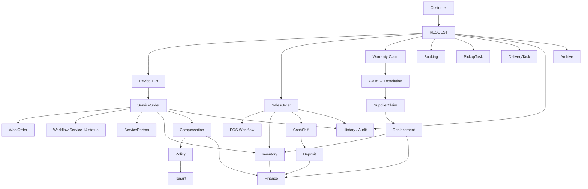

# 03 — Request Relationship

> **Sprint 6.1D · Architecture Freeze · Blueprint Only.**
> Relasi Request ke seluruh domain ServiceKU — ke hulu (Customer, Device), ke hilir (ServiceOrder, SalesOrder, Warranty, Finance, Archive), dan ke samping (PickupTask, DeliveryTask).
> Memperbarui **Business Reality Chain** yang sebelumnya dimulai dari Customer.

---

## 1. Peta Relasi (Updated — dengan Request sebagai Entry Point)



---

## 2. Kardinalitas (Updated — Sprint 6.1D)

| Relasi | Kardinalitas | Penjelasan |
|---|---|---|
| Customer → Request | 1..n | Satu customer bisa banyak request sepanjang waktu |
| Request → Device | 1..n | **Satu request bisa membawa banyak device** (BR-019, multi-device visit). Setiap device menghasilkan domain turunan sendiri. |
| Request → ServiceOrder | 0..n | Satu device → satu ServiceOrder. Request 3 device → 3 ServiceOrder. Request bisa tanpa ServiceOrder (Sales Only). |
| Request → SalesOrder | 0..n | Retail walk-in, pembelian langsung. Bisa juga berdampingan dengan ServiceOrder (beli sparepart + servis). |
| Request → Warranty Claim | 0..1 | Klaim garansi dimulai dari Request. |
| Request → Booking | 0..1 | Appointment booking. |
| Request → PickupTask | 0..1 | Untuk type=pickup/courier: tugas penjemputan. |
| Request → DeliveryTask | 0..1 | Untuk type=pickup/courier: tugas pengembalian. |
| ServiceOrder → WorkOrder | 0..n | **Progresif** (BR-018) — dapat ditambahkan bertahap. |
| ServiceOrder → Warranty | 0..1 | Service selesai memulai masa garansi. |
| Warranty → Claim → SupplierClaim → Replacement → Inventory → Finance | (rantai tetap — lihat `DomainRelationship.md`). |
| Request → History | 1..n | Setiap perubahan status tercatat. |
| Request → Archive | 0..1 | Setelah closed/cancelled lama. |

---

## 3. Business Reality Chain (Updated)

**Sebelum Sprint 6.1D:**
```
Customer → Device → ServiceOrder → Warranty → Claim → SupplierClaim
  → Replacement → Inventory → Finance → Compensation → Policy → Tenant
```

**Setelah Sprint 6.1D (ADR-001 — Request sebagai entry point):**
```
Customer → Request → Device(s) → [FORK: ServiceOrder | SalesOrder | Warranty | Booking]
  → Warranty → SupplierClaim → Replacement → Inventory
  → Finance → Compensation → Policy → Tenant
```

**Perubahan:**
- `Customer → Device` → jadi `Customer → Request → Device(s)` — request adalah wadahnya.
- Fork eksplisit — Request dapat bercabang ke satu atau lebih domain turunan dalam rantai yang sama.
- PickupTask & DeliveryTask ditambahkan sebagai relasi samping (non-finansial, operasional).

---

## 4. Aturan Relasi

1. **Request adalah orkestrator awal** — tidak boleh ada ServiceOrder/SalesOrder/Warranty tanpa Request (kecuali migrasi data lama).
2. **Multi-device (BR-019):** 1 Request → N Device → N ServiceOrder (parallel, masing-masing independen).
3. **Multi-fork:** 1 Request dapat menghasilkan kombinasi ServiceOrder + SalesOrder (mis. servis + beli sparepart) → dua jalur paralel.
4. **PickupTask/DeliveryTask terpisah** dari ServiceOrder — tugas logistik independen; bisa dikerjakan oleh kurir/teknisi yang berbeda.
5. Relasi ke Finance, Inventory, Compensation, Policy → **tidak berubah**. Request hanya menambah lapisan awal; rantai hilir identik.

---

## 5. Dampak ke Domain yang Sudah Ada

| Domain (Sprint 6.1) | Perubahan | Status |
|---|---|---|
| CustomerVisit | **Diganti** oleh Request(type=walk_in). CustomerVisit tetap ada sebagai data historis; tidak digunakan untuk entry point baru. | Deprecated sebagai entry point; dipertahankan sebagai data. |
| ServiceOrder | Tetap — namun wajib punya `request_id` (origin trace). | Additive |
| SalesOrder | Tetap — namun wajib punya `request_id` untuk yang berasal dari Request (walk-in retail). Walk-in tanpa request = legacy. | Additive |
| Warranty | Klaim garansi wajib dimulai dari Request. | Additive |
| Device | Tetap — sekarang melalui Request. | Tidak berubah |
| Inventory, Finance, Compensation, Policy | Tidak berubah. | Tidak berubah |

---

## 6. Prinsip yang Dipenuhi

| Prinsip | Cara |
|---|---|
| Business Driven | Mencerminkan realita: semua kerja masuk sebagai "permintaan", bukan langsung "tiket" |
| Grow Without Migration | Channel baru = type baru di Request, tanpa tabel baru |
| Simple by Default | Walk-in tetap sederhana (Request→ServiceOrder, 5 status) |
| Data is Sacred | Request = origin trace permanen; `request_id` di ServiceOrder/SalesOrder adalah immutable |
| Tenant Data Isolation | Request scope tenant |

---

## 7. Verifikasi

Seluruh relasi yang sudah ada di `docs/domain/DomainRelationship.md` tetap berlaku — Request **menambah** lapisan atas tanpa mengubah rantai bawah. Business Reality Chain invariant tetap: Replacement→Inventory→Finance→Compensation→Policy→Tenant.
