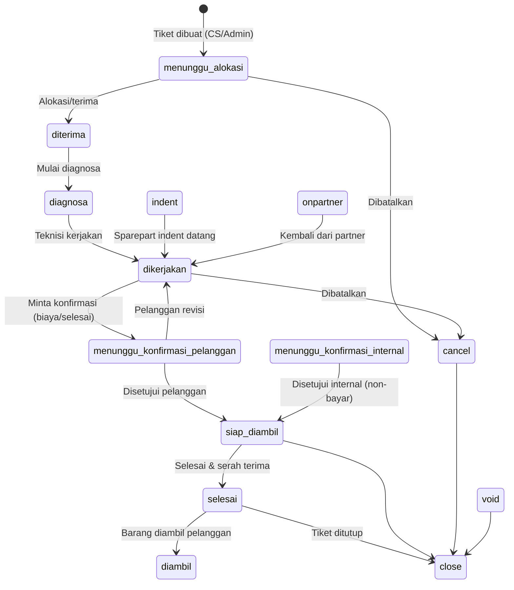
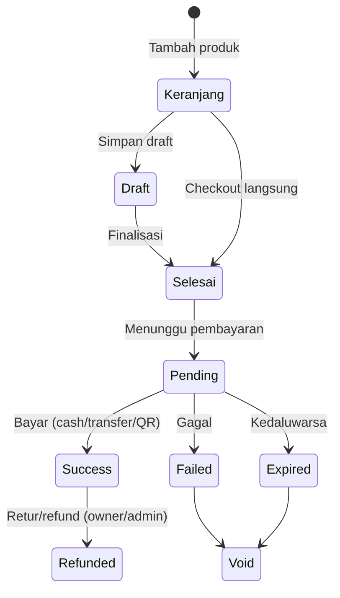
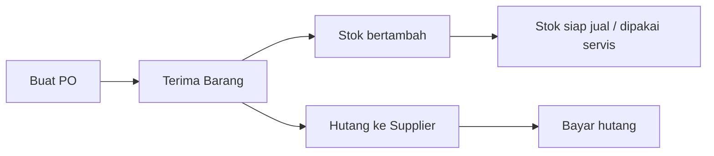
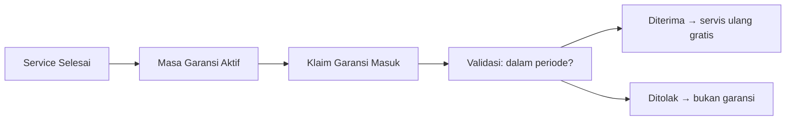
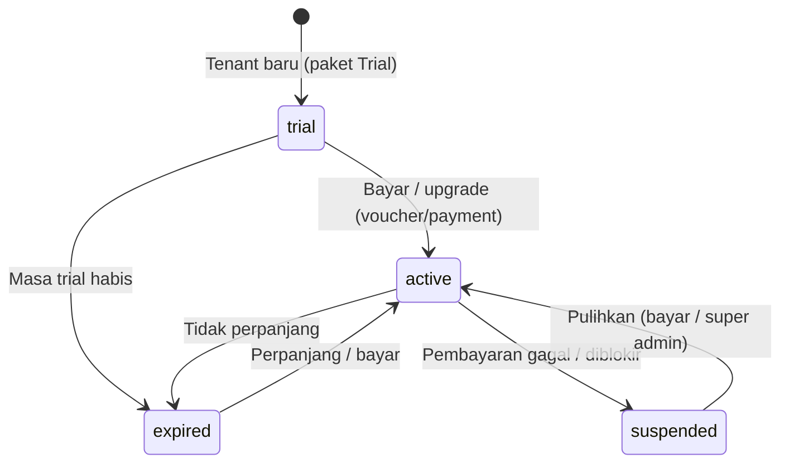
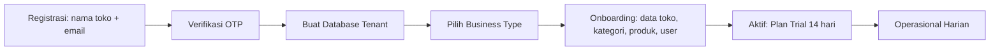

# ServiceKU — Workflow Specification

> Workflow nyata dari source code. Status & transisi ditulis sesuai yang terdefinisi di source; transisi yang tidak dipastikan diberi **"Perlu Verifikasi"**.

---

## 1. Workflow Service (Tiket Servis)

**Status resmi** (source): `menunggu_alokasi`, `diterima`, `diagnosa`, `dikerjakan`, `menunggu_konfirmasi_pelanggan`, `menunggu_konfirmasi_internal`, `siap_diambil`, `indent`, `onpartner`, `selesai`, `cancel`, `void`, `close`, `diambil`.



**Aturan:**
- `indent`: tiket menunggu sparepart (stok belum ada) → menunggu pembelian/indent.
- `onpartner`: servis dilempar ke partner/teknisi luar.
- `void`: pembatalan oleh owner/admin (finansial) → status terminal.
- `close`: status akhir terminal (dipakai untuk arsip).

---

## 2. Workflow Penjualan (POS)



**Status payment** (source): `pending`, `success`, `failed`, `expired`, `refunded`.

---

## 3. Workflow Pembelian



- PO dibuat oleh owner/admin/manager (`manage_purchases`).
- Penerimaan menambah stok & mencatat hutang supplier.

---

## 4. Workflow Inventory

```mermaid
flowchart LR
    A[Stok Masuk] --> B[Stok Tersedia]
    B --> C[Terpakai: Penjualan / Servis]
    B --> D[Transfer Antar Cabang]
    B --> E[Stok Menipis → Reorder]
    E --> F[Usulan Pembelian/Indent]
    B --> G[Adjustment (owner/admin)]
```

- `transfer_stock`: mutasi antar cabang (feature plan `multi_branch`/`transfer_stock`).
- `indent`: stok tidak ada → pesan (dari alur servis).

---

## 5. Workflow Garansi



- Garansi berbasis tiket servis yang sudah `selesai`.
- Detail periode & klaim per role: **Perlu Verifikasi**.

---

## 6. Workflow Subscription

**Status** (source): `trial`, `active`, `expired`, `suspended`.



**Alur:**
1. Tenant terdaftar → `trial` (14 hari, plan Trial).
2. Konversi ke `basic/pro/enterprise` saat bayar (Midtrans) atau redeem voucher.
3. `expired`/`suspended` → fitur non-inti dibatasi oleh `CheckPlanFeature`.
4. Super Admin dapat mengubah plan/status tenant dari panel admin.

---

## 7. Workflow Tenant (Onboarding)



- Multi-tenant: 1 database per tenant (`tenant_<uuid>`).
- Business type dipilih saat onboarding → menentukan fitur default (template).
- Super Admin mengelola tenant dari panel `/admin`.

---

## 8. Verifikasi Sumber

**Terkonfirmasi dari source:**
- Status service (14 nilai), status payment (5 nilai), status subscription (4 nilai).
- Alur onboarding & pembuatan DB tenant (stancl/tenancy).
- Alur POS & kas (draft/selesai/pending/success).

**Perlu Verifikasi:**
- Transisi status service yang diizinkan per role (guard sisi server per aksi).
- Periode & aturan klaim garansi.
- Batas waktu transisi `pending → expired` di POS.
- Aturan reorder / ambang stok.
